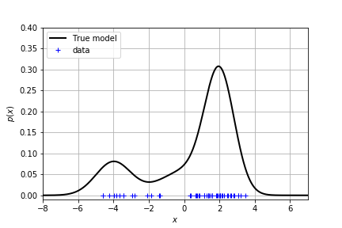
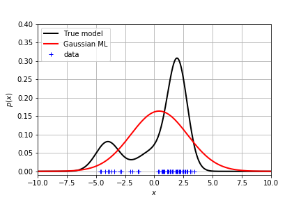
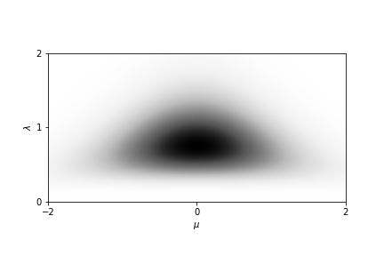
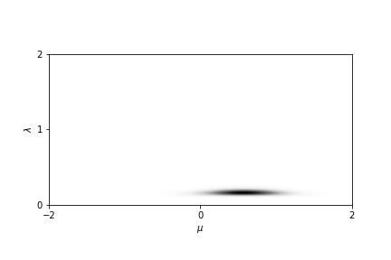
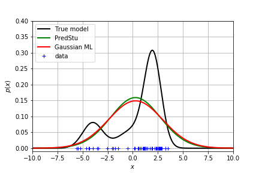
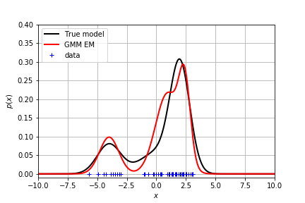
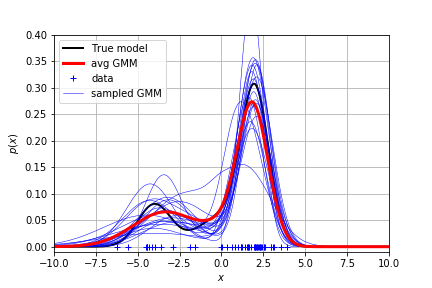

## 任务场景

给定数据，真实的分布是未知的。我们学习的任务就是去拟合出真实的分布。现在我们给出一个真实分布是 GMM，在上面采样得到一组数据。你是否能够根据数据去拟合出这个分布？

```py
GMM(means, variances, weights)
true_model = models.GMM([-4, 0, 2], [1, 2, .7], [0.2, 0.2, 0.6])
```


## 单峰分布

### 用高斯分布拟合

我们知道高斯分布是长这样的
$$
\DeclareMathOperator{\Norm}{\mathcal{N}}
\DeclareMathOperator{\Gam}{Gam}
\DeclareMathOperator{\e}{exp}
p(x \mid \mu, \sigma^2) = \Norm(x \mid \mu, \sigma^2) = \frac{1}{\sqrt{2\pi\sigma^2}} \e\{ \frac{-(x - \mu)^2}{2\sigma^2} \}
$$
* $\mu$ is the **mean** of the Gaussian density 
* $\sigma^2$ is the **variance** of the Gaussian density
* $\lambda = \frac{1}{\sigma^2}$ is the **precision** of the Gaussian density

（等等我们可以用 $\lambda$ 代替方差来写高斯分布）


为了估计真实的分布，可以采用最大化似然的办法得到均值和方差
$$
\begin{align}
\mu &= \frac{1}{N} \sum_i x_i \\
\sigma^2 &= \frac{1}{N} \sum_i x_i^2
\end{align}
$$

```py
N = len(X)
mean = np.sum(X)/N
var = np.sum(X**2)/N
```


显然这个结果不能很好地拟合真实分布。

### 贝叶斯推理：加入均值和方差的先验

A common and convenient choice of prior for the Gaussian is the **Normal-Gamma** prior:

$$
p(\mu, \lambda \mid m_0, \kappa_0, a_0, b_0) = \Norm(\mu \mid m_0, (\kappa_0 \lambda)^{-1}) \Gam(\lambda \mid a_0, b_0)
$$

where:

$$
\Gam(\lambda \mid a_0, b_0) = \frac{1}{\Gamma(a_0)} b_0^{a_0} \lambda^{a_0 - 1} \e \{ -b_0 \lambda\}
$$

$m_0$, $\kappa_0$, $a_0$ and $b_0$ are called **hyper-parameters**. They are the parameters of the prior distribution.

为了对 Normal-Gamma 分布有个形象的了解，可以绘图看到，它的均值和方差是服从这样的概率分布的
```py
NormalGamma(mean, kappa, a, b)
ng_prior = models.NormalGamma(0, 2, 5, 6)
```



由于 Normal-Gamma 是 正态分布的 **共轭先验**，因此 Normal-Gamma 的后验有闭式解，且可以写成如下形式：
$$
p(\mu, \lambda \mid \mathbf{x}) = \Norm(\mu \mid m_n, (\kappa_n \lambda)^{-1}) \Gam(\lambda \mid a_n, b_n)
$$

where:

$$
\begin{align}
m_n &= \frac{\kappa_0 m_0 + N \bar{x}} {\kappa_0 +  N} \\
\kappa_n &= \kappa_0 + N \\
a_n &= a_0 + \frac{N}{2} \\
b_n &= b_0 + \frac{N}{2} ( s + \frac{\kappa_0 (\bar{x} - m_0)^2}{\kappa_0 + N} ) \\
\bar{x} &= \frac{1}{N} \sum_i x_i \\
s &= \frac{1}{N} \sum_i (x_i - \bar{x})^2
\end{align}
$$

$N$ is the total number of point in the the training data and $m_n$, $\kappa_n$, $a_n$ and $b_n$ are the parameters of the posterior. Note that they are different from the hyper-parameters !! 

因此加入后验的影响后，均值和方差的分布成为更加聚集的一小团。



当需要做预测任务时，则需要把均值和方差边缘化（积分掉），得到数据分布。恰好这个分布是学生分布。由此可以得到每个数据点的概率密度：



但是由于是单峰的，拟合效果还是很差！

## 多峰分布

### 用高斯混合模型拟合

我们尝试用 K 个不同的高斯分布来拟合真实分布：

$$
    p(x|\boldsymbol{\mu}, \boldsymbol{\lambda}, \boldsymbol{\pi}) = \sum_{k=1}^{K} \pi_k \Norm(x|\mu_k, (\lambda_k)^{-1})
$$
* $\boldsymbol{\mu}$ is the vector of $K$ means
* $\boldsymbol{\lambda}$ is the vector of $K$ precisions
* $\boldsymbol{\pi}$ is the vector of $K$ weights such that $\sum_{k=1}^K \pi_k = 1$ 

其中给不同高斯加的权重作为隐变量。

### 用 EM 算法求解参数

* initialize the parameters of the GMM 
* iterate until convergence ($ \log p(\mathbf{x} | \theta^{new}) - \log p(\mathbf{x} | \theta^{old}) \le 0.01$):
    * Expectation (E-step): compute the probability of the latent variable for each data point
    * Maximization (M-step): update the parameters from the statistics of the E-step. 

具体推导可以看 [Expectation Maximization algorithm](https://baileyswu.github.io/2018/11/Expectation-Maximization/) 以及 [GMM](https://baileyswu.github.io/2019/09/gaussian-mixture-model)

```py
last_llh = -1e8
while 1e-2 < np.absolute(llh - last_llh):
    # E-step
    Z = gmm.EStep(X)
    
    # M-step
    gmm.MStep(X, Z)
    
    last_llh = llh
    llh = gmm.logLikelihood(X)
    print('log-likelihood:', llh)
```

具体的 `EStep` 和 `MStep` 可以看[这里](https://github.com/iondel/JHU2016Labs/blob/5575a4e797ce57ed3a033b662ded996b9d79d8a6/jhu2016_labs/models.py#L75)

不同的参数初始化得到的效果不同。这里给出了一个拟合得较好的分布：



### 贝叶斯推理：加入先验

加入参数的先验：
$$
\DeclareMathOperator{\Dir}{Dir}
p(\boldsymbol{\pi}) = \Dir(\boldsymbol{\pi} \mid \boldsymbol{\alpha}_0)
$$
$$
p(\mu_k, \lambda_k) = \Norm(\mu_k \mid m_0, (\kappa_0 \lambda_k)^{-1}) \Gam(\lambda_k \mid a_0, b_0)
$$

如果仍旧想用 EM 算法求解参数，则在 M 步会直接把均值和方差算出来，而不是算出均值和方差的后验。因此不能用 EM 算法。

考虑到参数之间有相互依赖的关系，可以用 Gibbs Sampling 得到参数的后验分布。给出以下三个条件分布，在每次迭代中，都假设知道了条件值，采出样本。最终它们将趋向于真实分布。

#### latent variable $z_i$
$$
\begin{align}
p(z_i \mid \mathbf{x}, \Theta) &= p(z_i \mid x_i, \boldsymbol{\pi}, \boldsymbol{\mu}, \boldsymbol{\lambda}) \\
p(z_i = k \mid x_i, \boldsymbol{\pi}, \boldsymbol{\mu}, \boldsymbol{\lambda}) &= \frac{\pi_k \Norm(x_i \mid \mu_k, \lambda_k)} {\sum_{j=0}^{K} \pi_j \Norm(x_i \mid \mu_j, \lambda_j)}
\end{align}
$$

#### mean and variance 
We define the set of all data point $x_i$  that are assigned to the component $k$ of the mixture as follows:
$$
\mathbf{x}_{(k)} = \{ x_i : z_i = k, \forall i \in \{1,... , N \} \} 
$$
and similarly for the latent variables $\mathbf{z}$:
$$
\mathbf{z}_{(k)} = \{ z_i : z_i = k, \forall i \in \{1,... , N \} \} 
$$

$$
\begin{align}
p(\mu_k, \lambda_k \mid \mathbf{x}, \mathbf{z}, \Theta_{\smallsetminus \{ \mu_k, \lambda_k \} } ) &= p(\mu_k, \lambda_k \mid \mathbf{x}_{(k)}, \mathbf{z}_{(k)}, \Theta_{\smallsetminus \{ \mu_k, \lambda_k \} } ) \\
&= \Norm(\mu_k \mid m_{n,k}, (\kappa_{n,k} \lambda_k)^{-1}) \Gam(\lambda_k \mid a_{n,k}, b_{n,k})
\end{align}
$$

where:

$$
\begin{align}
m_{n,k} &= \frac{\kappa_0 m_0 + N_k \bar{x}_k} {\kappa_0 +  N_k} \\
\kappa_{n,k} &= \kappa_0 + N_k \\
a_{n,k} &= a_0 + \frac{N_k}{2} \\
b_{n,k} &= b_0 + \frac{N_k}{2} ( s + \frac{\kappa_0 (\bar{x}_k - m_0)^2}{\kappa_0 + N_k} ) \\
N_k &= \left\vert \mathbf{x}_{(k)} \right\vert \\
\bar{x}_k &= \frac{1}{N_k} \sum_{\forall x \in \mathbf{x}_{(k)}} x \\
s_n &= \frac{1}{N} \sum_{\forall x \in \mathbf{x}_{(k)}} (x_i - \bar{x})^2
\end{align}
$$

NOTE: these equations are very similar to the Bayesian Gaussian estimate. However, it remains some difference

#### weights

$$
\begin{align}
p( \boldsymbol{\pi} \mid \mathbf{x}, \mathbf{z}, \Theta_{\smallsetminus \{ \boldsymbol{\pi} \} } ) &= p( \boldsymbol{\pi} \mid \mathbf{z}) \\
&= \Dir(\boldsymbol{\pi} \mid \boldsymbol{\alpha})
\end{align}
$$
where:
$$
\alpha_{n,k} = \alpha_{0,k} + N_k \; ; \; \forall \, k = 1\dots K 
$$

```py
for i in range(20):
    # Sample the latent variables
    Z = bgmm.sampleLatentVariables(X)
    
    # Update the parameters
    bgmm.sampleMeansVariances(X, Z)
    bgmm.sampleWeights(Z)
    
    # Just for plotting, this is not part of the Gibbs Sampling algorithm.
    plotting.plotGMM(bgmm.gmm, fig=fig, ax=ax, color='b', lw=.5, label='sampled GMM')
```



每次迭代的参数都可以生成一条蓝线。把蓝线加权平均得到了红线。看起来还是比较接近真实分布的。

## 相关教程

- [Introduction To Bayesian Inference (jupyter notebook)](https://github.com/iondel/JHU2016Labs)
- [Gibbs sampling for fitting finite and infinite Gaussian mixture models](kamper_bayesgmm13.pdf)