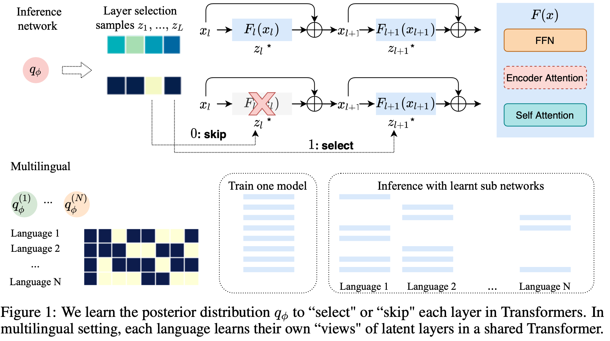

Transformer 框架模型常常通过增加模型的深度来提升性能，但实际上简单地堆叠层高并不能显著地增加模型的性能。常见的方式是去共享 Transformer 的网络，但是如何共享仍旧是一个问题，它需要在不同语言或者任务间可以正向迁移。
如何去优化一个更深的网络是这个 IDEA 产生的原因

## 摘要
> Transformer 模型在许多序列建模任务中取得了最先进的性能。然而，如何利用大深度或可变深度的模型仍然是一个开放的挑战。我们提出了一个概率框架，通过后验分布来自动学习要使用的层。作为transformer的一个扩展，我们提出了一种新的方法来训练一个共享参数的 Transformer 网络用于多语言机器翻译，每个语言对具有不同的层选择后验。所提出的方法减轻了消失梯度，以稳定的深度训练 Transformer （如100层）。我们评估了 WMT 英德机器翻译和 Masked 语言建模任务，对于训练更深的Transformer，我们的方法优于现有的方法。在多语种机器翻译中的实验表明，该方法能有效地利用增加的模型大小，在多对一和多对多语言的翻译都有普遍的改进。

## Main Points

提出了一个共享多语言间的 Transformer 共享机制，建立潜变量 z。它的大小是一个实数值，当梯度下降的时候使用这个实数值，而在决定是否使用某层网络的时候，则取离散值，即 0 或者 1.

$$x_{l+1}=x_l + z_l \times F_l(x_l), z_l \sim p(z;l)$$

要求似然，则需要积分所有的 z 和 网络参数，不现实。因此采用变分推理的方法，假设 z 其服从一个先验分布，即 Beta 分布。再用一个后验分布拟合。

## Experiments
### 要说明两件事
1. 是否在深度的 Transformer 上有更快的训练和更好的效果
2. 在多语言机器翻译上是否有更好的效果

### 实验任务
1. 双语机器翻译 
   - English-German
2. 交叉 Masked 语言建模
3. 多语言机器翻译 
   - 58-language TED corpus
   - 语言之间有相近和相远的组 related and diverse
   - 多语言和英语之间的关系 M2O， O2M
4. 与 Baselines 进行比较
   - 在固定深度的 Transformer 上进行一般的优化
   - Random Layer drop
   - DLCL: Dynamic linear combination of layers, applying dense connections between layer.
   - ReZero: learns weighting parameters but gradient exploding.

## Results
### 解决梯度消失
固定深度的 Transformer，2a 解码器底层底层的梯度慢慢消失了。优化以后的 2b 则梯度出现了。

层数更深的损失更小。

### En-De 机器翻译
LL-D: latent layer in decoder
LL-Both: latent layer in decoder and encoder
LL-Both 可以利用更深的模型，提高了泛化性能。

### Masked 语言建模
随着层数增加，静态层数的方法逐渐发散。而 LL 直到 96 层还没有发散的情况。

### 多语言翻译
在 related 和 diverse 两组语言中进行多语言机器翻译的任务，LL 在层数增加时损失不发散，而原来的方法会发散。

## Reference
[1] [NIPS 2020: Deep Transformers with Latent Depth](https://proceedings.neurips.cc/paper/2020/file/1325cdae3b6f0f91a1b629307bf2d498-Paper.pdf)