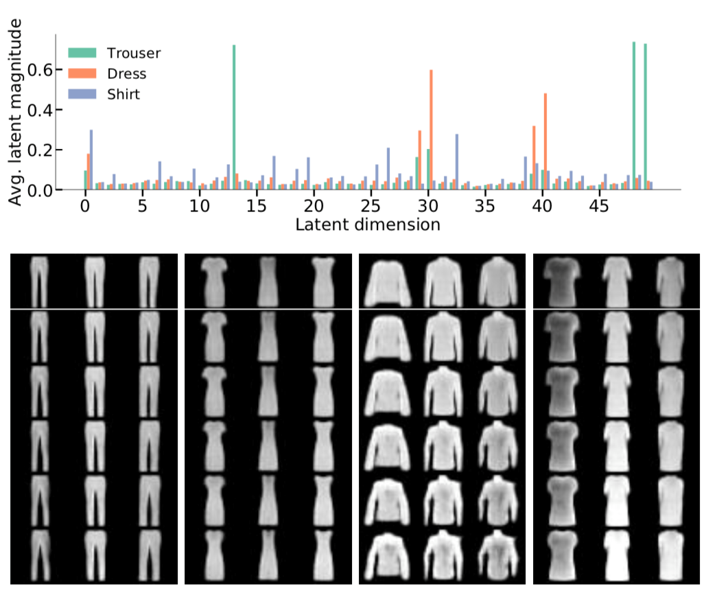
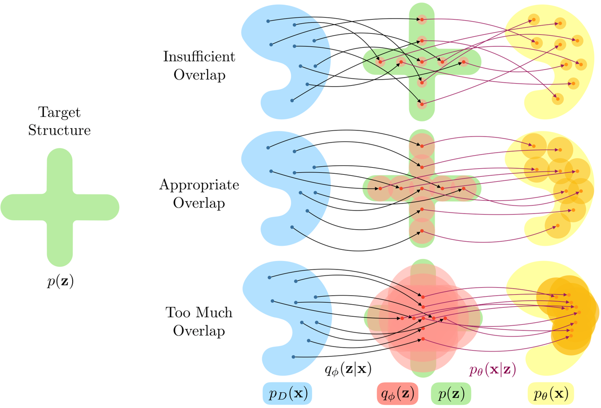
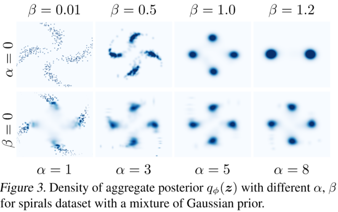

对于深度生成模型而言，数据的可解释性具有重要的意义。如果可以解释 VAE 在编码以后的成分，那么有选择性地改变隐层的部分数据，就可以指导性地生成不同的观测（图片、音频等）。由于在隐层中的表示并不是我们想象中那么独立的，实际上需要做一些变换，使得不同的特征可以解开纠缠（Disentangling Disentanglement）。

如图可以看到衣服的特征在隐层被提取出 49 维特征。若干个特征组合可以控制一个实质的衣服的特性（裤腿宽度、袖子长度等）。

## Main Points

这篇论文主要提出了以下几个观点：

- 分解（decomposition）得好需要满足两个方面：overlap, structure
- 理论分析了 $\beta$-VAE 可以满足第一个方面，但不能满足第二个方面
- 给 $\beta$-VAE 的再增加一个约束项可以同时满足这两个方面

## Decomposition: A Generalisation of Disentanglement

**分解**（Decomposition）是一种广义上的 **解纠缠**（Disentanglement）.

对于解纠缠来说，要求一个比隐层更为抽象的真实空间的各个 **generative factors (GF)** 都是相互独立的。这个条件比较苛刻。

对于分解而言，并不要求 GF 相互独立。只要它在隐层的空间中可以学习出一种隐含的结构就够了。这种结构一般都由先验来显式地表示。

> **Tips on GF**  
经过 VAE 的编码，可以生成我们的隐空间。在隐空间上，可以再抽象出一个 GF 空间。理想状况下，我们希望隐空间可以解释所有的 GF 空间。比如隐空间的向量 $h_1,h_2$ 在调整数值后可以改变袖子的长短。而袖子的长度即是一种 GF。而实际上，往往没有这么好的隐表示，通常都会有一个隐向量 $h_1$ 改变后，多个 GF 受到了影响。为了更接近我们的理想，需要对隐空间做一些结构化的假设，以学得更好的隐表示。

分解的表现如何，可以用两个方面来衡量：
- The latent encodings of data having an appropriate level of **Overlap** 
- The aggregate encoding of data conforming to a desired **Structure**, represented through the prior.

这两个因素是相辅相成的。如果没有 overlap，分布之间太稀疏，将变为查表，导致隐层含有的信息太少。如果没有 structure，隐层将不会按照特定的结构化分解。

还有一个值得注意的地方是，在 VAE 中我们总是会假设变分分布是各向同性的高斯分布，但从实验结果来看这并不利于解纠缠。

## Decomposition Analysis of $\beta$-VAE

$\beta$-VAE 的改动在于在 ELBO 式中给 KL 散度设定了一个正系数 $\beta$，
$$
\mathcal{L}_{\beta}({x})=\mathbb{E}_{q_{\phi}({z} | {x})}\left[\log p_{\theta}({x} | {z})\right]-\beta \operatorname{KL}\left(q_{\phi}({z} | {x}) \| p({z})\right).
$$
通过后面的理论分析，将要说明 $\beta$-VAE 可以学出好的 overlap，但不能有 structure 的表示。

### ELBO 的定义
$$
\log p(x)=\log \int_{z} p(x, z) d z \geq \mathbb{E}_{q}[\log p(x | z)]-\operatorname{KL}(q(z | x) \| p(z)) \triangleq \mathcal{L}
$$

加入了 $\beta$ 这个系数以后，使得 $\mathcal{L}_{\beta}$ 并不是 $\log p(x)$ 真正意义上的下界。将 $\mathcal{L}_{\beta}$ 拆分，
$$
\mathcal{L}_{\beta}=\mathcal{L}\left({x} ; \pi_{\theta, \beta}, q_{\phi}\right)+(\beta-1) H_{q_{\phi}}+\log F_{\beta}
$$
可以得到符合形式的下界 $\mathcal{L}\left({x} ; \pi_{\theta, \beta}, q_{\phi}\right)$，以及为了凑出这个下界而产生的多余项。
$$
\mathcal{L}\left({x} ; \pi_{\theta, \beta}, q_{\phi}\right)=\mathbb{E}_{q_{\phi}({z} | {x})}\left[\log p_{\theta}({x} | {z})\right]-\mathrm{KL}\left(q_{\phi}({z} | {x}) \| f_{\beta}({z})\right)
$$
这个下界的先验（annealed prior）为 $f_{\beta}({z}) \triangleq p({z})^{\beta} / F_{\beta}$，它的分母 $F_{\beta} \triangleq \int_{z} p(z)^{\beta} d z$ 在给定 $\beta$ 以后是一个常数。$\beta$ 出现在指数上，它可以调整 $ z$ 的尺度。

$H_{q_{\phi}}$ 是变分分布 $q_{\phi}({z} | {x})$ 的熵，熵越小，则变分分布的方差越小，其 overlap 就可以变小。因此这一项在调整 $\beta$ 以后可以控制 overlap. 但是 $H_{q_{\phi}}$ 对于隐层的旋转不敏感，因此它不能控制隐层的形状，即不影响 structure，也不鼓励学出一个更好的 structure.

$\log F_{\beta}$ 是一个常数项，因此优化时只需要优化前两项之和，得到的极值点与 $\mathcal{L}_{\beta}$ 一致。

### $\beta$ 的作用

$\beta$ 出现在 $f_{\beta}({z})$ 和 $(\beta-1) H_{q_{\phi}}$ 两处。当 $\beta$ 增大时，将出现两个方面的作用：  
1. $f_{\beta}({z})$ 使得 ${z}$ 的尺度变小，$\mathrm{KL}\left(q_{\phi}({z} | {x}) \| f_{\beta}({z})\right)$ 约束变分分布跟着变陡。
2. $(\beta-1) H_{q_{\phi}}$ 使得 $H_{q_{\phi}}$ 增大，使得变分分布变平坦。

这两者相互协调使得编码出来的边缘分布 $q_{\phi}({z})$ 和先验 $p({z})$ 的尺度相匹配。

但是当 $\beta$ 太大的时候，$H_{q_{\phi}}$ 过大，变分分布过于平坦，造成过多的 overlap，不利于解纠缠。

### 先验选择

当用各向同性的高斯作为先验时，不能鼓励隐变量得到有意义的隐表示。
换句话说，它可以鼓励隐表示去匹配factor，但不能去匹配旋转后的factor。但旋转以后的factor可能与隐变量强相关。这样的信息就被隐去了。

## An Objective for Enforcing Decomposition

本论文新加了一个约束项在最后，表示变分边缘分布和先验的距离，
$$
\mathcal{L}_{\alpha, \beta}({x})=\mathbb{E}_{q_{\phi}({z} | {x})}\left[\log p_{\theta}({x} | {z})\right]
-\beta \operatorname{KL}\left(q_{\phi}({z} | {x}) \| p({z})\right)-\alpha \mathbb{D}\left(q_{\phi}({z}), p({z})\right)
$$
增加了这一项，有助于学得一个更好的 structure. 它的选项是开放性的，可以用 $\mathrm{KL}\left(q_{\phi}({z}) \| p({z})\right)$、maximum mean discrepancy (MMD)、a variational formulation of the Jensen-Shannon divergence 等多种距离或熵来约束。

第一行可以看到，随着 $\beta$ 增大，解纠缠的效果逐渐变差，最后聚类也减少至两个。

而第二行中，随着 $\alpha$ 增大，其仍旧能保持较好的 structure.

## Inspiration

1. 变分分布避免设置为各向同性的高斯分布。
2. 调节 $\beta$ 避免过多的 overlap.
3. 可以尝试增加 $\alpha$ 带的约束项，但实际上是比较难算的。
4. 理论分析得深入也可以中顶会ヽ(￣ω￣(￣ω￣〃)ゝ

## Reference 

- [Disentangling Disentanglement in Variational Autoencoders, ICML 2019](http://proceedings.mlr.press/v97/mathieu19a.html)
- [The $\beta$-VAE's Implicit Prior, NIPS 2017](http://bayesiandeeplearning.org/2017/papers/66.pdf)