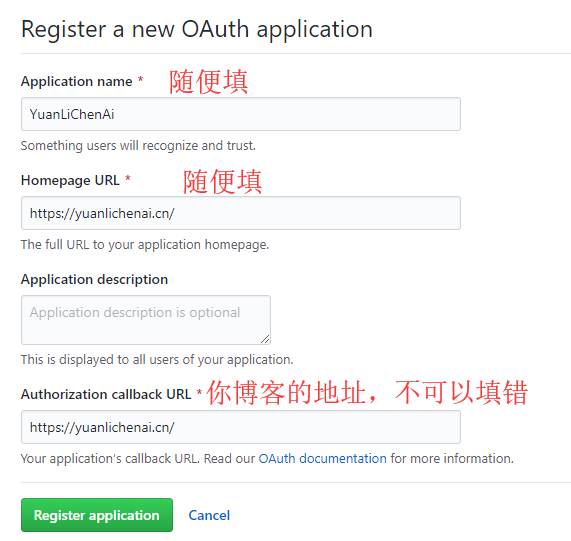

鉴于后台有人留言夸我可爱（呼呼）却不知道是哪位粉丝，现开通连名带姓的评论功能哈哈哈。

[Gitalk](https://github.com/gitalk/gitalk) is good，转了转了。

原载地址 [Gitalk配置教程](https://yuanlichenai.cn/2020/01/16/Gitalk/)

另外为了保留原来的评论以及阅读统计功能，还保留了 valine 的 js，这一折腾又入门了半个前端。

## 文件修改

新建 `gitalk.ejs` 文件

位置：themes\Chic\layout\_plugins\gitalk.ejs

```js
<link rel="stylesheet" href="https://cdn.jsdelivr.net/npm/gitalk@1.5.2/dist/gitalk.css">
<script src="https://cdn.jsdelivr.net/npm/gitalk@1.5.2/dist/gitalk.min.js"></script>
<div id="gitalk-container"></div>
<script type="text/javascript">
      var gitalk = new Gitalk({
        clientID: '<%= theme.gitalk.ClientID %>',
        clientSecret: '<%= theme.gitalk.ClientSecret %>',
        repo: '<%= theme.gitalk.repo %>',
        owner: '<%= theme.gitalk.owner %>',
        admin: '<%= theme.gitalk.adminUser %>',
        id: <%= theme.gitalk.ID %>,
        labels: '<%= theme.gitalk.labels %>'.split(',').filter(l => l),
        perPage: <%= theme.gitalk.perPage %>,
        pagerDirection: '<%= theme.gitalk.pagerDirection %>',
        createIssueManually: <%= theme.gitalk.createIssueManually %>,
        distractionFreeMode: <%= theme.gitalk.distractionFreeMode %>
      })
      gitalk.render('gitalk-container')
</script>
```

引入 `gitalk`

位置： themes\Chic\layout\post.ejs
也可以加在 `page.ejs` 那里。

添加内容
```js
<% if (theme.gitalk.enable) { %>
    <div id="gitalk-container"></div>
    <%- partial('_plugins/gitalk') %>
<% } %>
```


## 配置_config.yml
获取 `client_id` 和 `client_secret`
首先创建一个 [OAuth application 应用](https://github.com/settings/applications/new).




## 在主题_config.yml中添加配置
```yml
gitalk:
  enable: true
  ClientID: xxxxx #Client ID,填入上一步获取的ID
  ClientSecret: xxxxxxxxxx #Client Secret，填入上一步获取的ID
  repo: blog #你要存放的项目名,如果博客部署在github可以放一起
  owner: YuanLiChenAi #这个项目名的拥有者（GitHub账号或组织）
  adminUser: ['YuanLiChenAi'] #管理员用户
  ID: location.pathname #页面ID
  labels: ['Gitalk'] #GitHub issues的标签
  perPage: 10 #每页多少个评论
  pagerDirection: last #排序方式是从旧到新（first），还是从新到旧（last）
  createIssueManually: true #是否自动创建isssue，自动创建需要当前登录的用户为adminuser
  distractionFreeMode: false #是否启用快捷键(cmd|ctrl + enter) 提交评论
```

## 调整gitalk样式
在自定义样式表中添加样式
文件路径：themes\Chic\source\css\custom.styl

```yml
// Gitalk评论样式
.gt-container {
    max-width: 780px;
    margin: auto;
}
```
