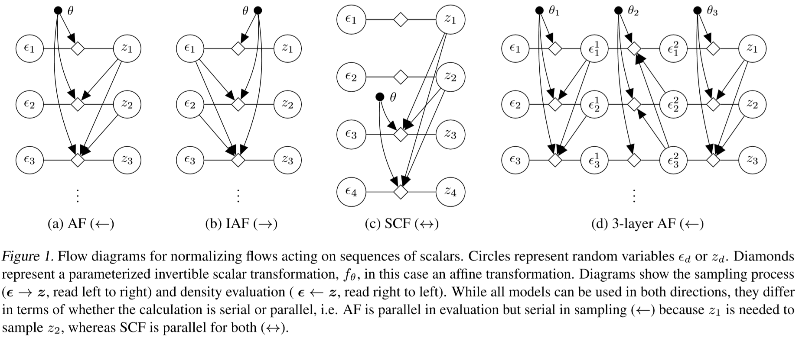
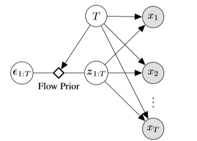
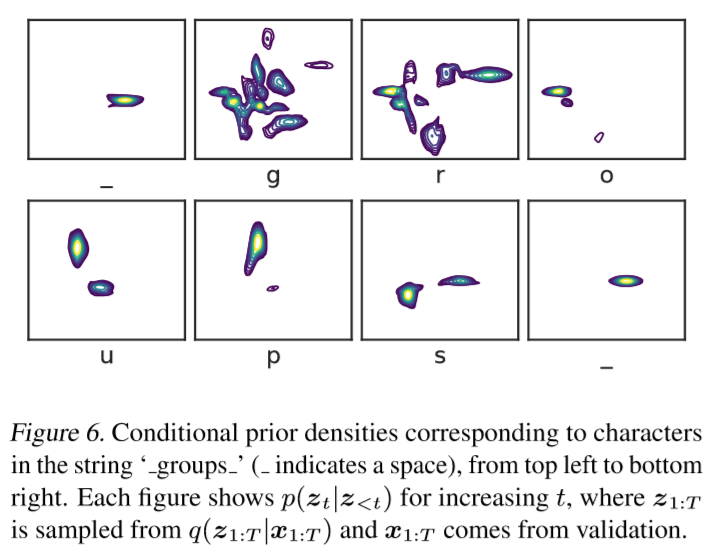
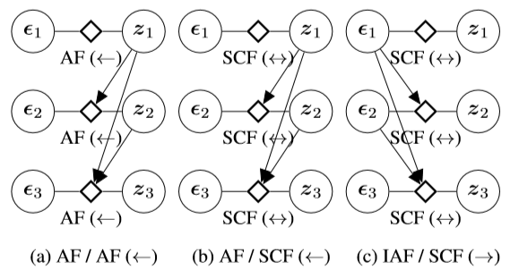

规范化流 （Normalizing Flows, NF）在连续随机变量的建模上是个非常有用的一类模型，优点有：较强的模型灵活性；可用于非自回归（non-autoregressive）生成任务中。但是要把连续变量换成离散变量，仍有一些挑战。

## Main Points: Latent Flows for Discrete Sequence

这篇论文主要提出了一种用于离散变量序列的隐变量模型，它可以从连续分布中学习得到一个基于 `NF` 的隐层分布用以描述离散变量。关于这个隐层的分布可以设置不同的先验，保证模型的灵活性。

### Basic Normalizing Flows Blocks

规范化流用于建模隐层的联合分布 $p(Z)$. 在一些任务中 $Z$ 未必是隐层，也有可能是实际的观测。Anyway，有一个比 $Z$ 还要更上一层的 $\epsilon$ 用于更为抽象的表示，并建模关系 $f_{\theta}: \epsilon \rightarrow Z$. 这意味着，当 $\epsilon$ 从一个简单的分布 $p(\epsilon)$ 采样时，可以通过这层映射关系得到 $z$，即 $z = f_{\theta}(\epsilon)$. 

由于两者积分都为 1，因此两者相互变化时满足一个恒等式
$$
p_{Z}(z)=p_{\epsilon}\left(f_{\theta}^{-1}(z)\right)\left|\operatorname{det} \frac{\partial f_{\theta}^{-1}(z)}{\partial z}\right|.
$$
这个恒等式意味着两个随机变量的概率转化在行列式可算的情况下将非常简单。当雅可比矩阵是三角矩阵时，行列式将是线性可算的。如何构造三角矩阵呢？有以下几种方法：

#### Autoregressive Flow (AF)

$z_t$ 与 $z_{<t}$ 之间有依赖关系（自回归模型，`autoregressive`），导致 $z$ 的产生必须是串行的。这导致在采样（`sampling`）的过程中计算比较缓慢。而反之，在估计（`evaluation`）的过程中，$\epsilon$ 之间并没有相互依赖的关系，因此可以并行计算。

这里的映射关系考虑地也相对简单，是线性的表达式。
$$
\begin{aligned}
f_{\theta}(\boldsymbol{\epsilon})_{d}=z_{d} &=a\left(\boldsymbol{z}_{<d} ; \theta\right)+b\left(\boldsymbol{z}_{<d} ; \theta\right) \cdot \epsilon_{d} \\
f_{\theta}^{-1}(\boldsymbol{z})_{d} &=\epsilon_{d}=\frac{z_{d}-a(\boldsymbol{z}<d ; \theta)}{b(\boldsymbol{z}<d ; \theta)} 
\end{aligned}
$$

#### Inverse Autoregressive Flow (IAF)

有一种简单的想法，就是把依赖关系搬到 $\epsilon$ 上，那么和 AF 相反，在采样时可以并行，而在估计时需要串行。

$$
\begin{aligned} f_{\theta}(\epsilon)_{d}=z_{d} &=a\left(\epsilon_{<d} ; \theta\right)+b\left(\epsilon_{<d} ; \theta\right) \cdot \epsilon_{d} \\ f_{\theta}^{-1}(z)_{d} &=\epsilon_{d}=\frac{z_{d}-a\left(\epsilon_{<d} ; \theta\right)}{b\left(\epsilon_{<d} ; \theta\right)} \end{aligned}
$$

#### Split Coupling Flow

为了更好的并行化，可以抽出一部分 $z$ 形成一个集合 $S$，未被抽到的组成集合 $\bar S$，并让 $S$ 中的所有变量去影响 $\bar S$ 中的每一个变量形成，而 $\bar S$ 之间并不相互影响。那么对于所有 $\bar S$ 中的元素而言，其采样是可以并行的。与此同时，反向的估计也是并行的。
$$
\begin{aligned} f_{\theta}(\epsilon)_{d}=z_{d} &=a\left(z_{\mathcal{S}} ; \theta\right)+b\left(z_{\mathcal{S}} ; \theta\right) \cdot \epsilon_{d} \\
f_{\theta}^{-1}(z)_{d} &=\epsilon_{d}=\frac{z_{d}-a\left(z_{\mathcal{S}} ; \theta\right)}{b\left(z_{\mathcal{S}} ; \theta\right)} \end{aligned}
$$

但是它的缺点也很明显。$z_t$ 不必再依赖于 $z_{<t}$，即此时的模型不再是一个自回归模型（ `non-autoregressive` ）。由于没用建模时序之间的依赖关系，最终的损失也会比较高。

#### Layers Flows

组合 `SCF`，使得每一层使用的子集 $S$ 都有所不同。这样做使得多层之后 $z$ 之间可以相互关联。

#### 比较

前三个表达式相比，只有自变量发生了变化，映射的形式等保持不变。

前两个方案虽然看起来差不多，但实际上前者在训练时损失更小。因为 IAF 没用考虑隐层转移的时序关系，因此在模型学习上存在一些缺陷。

关于这三种构造方案是三角矩阵的证明可以参考附录。

这三种方案将作为 Block 被用于隐层的构建，简写为 $f_{\mathrm{AF}}(\boldsymbol{\epsilon} ; \theta), f_{\mathrm{IAF}}(\boldsymbol{\epsilon} ; \theta),$ and $f_{\mathrm{SCF}}(\boldsymbol{\epsilon} ; \theta)$.

### Generating Discrete  Sequences

Latent NF 用到的模型如下，其中 `Flow Prior` 的内容将在后面展开。该图模型假设了观测之间是条件独立的。其时序关系用 $z$ 来建模。最后可以得到

$$
p\left(\boldsymbol{x}_{1: T} | \boldsymbol{z}_{1: T}, T\right)=\prod_{t=1}^{T} p\left(x_{t} | \boldsymbol{z}_{1: T}, T\right)
$$

其中时序的长度为  $T$，隐空间大小为 $H$，意味着共有 $D=T\times H$ 的维度用于规范化流。

### Criteria for Effective Flow Parameterization

对于连续模型而言，提高模型的灵活性并不有助于在数据上更好地建模。

对于离散模型而言，可以建模调整模态的位置和数目。

这里引入 `multimodal` 这一概念，用以表示已知 $z_{<t}$ 时 $p(z_t)$ 的多样性。下图即说明了在各个字符输入的过程中，$p\left(\boldsymbol{z}_{t} | \boldsymbol{z}_{<t}\right)$ 的分布情况。在输入 s 时，有 `group`, `groups`两种情况，因此有两类。而到最后表示单词确定，因此只有一团。

### Flow Architectures for Sequence Dynamics

本模型的重点在于对 $D=T\times H$ 的维度做了两层处理。一是对于某一时刻而言，其内部进行维度为 $H$ 的规范化流 ( `NF in hidden` )。再对所有时刻的联合做一个维度为 $T$ 的规范化流 ( `NF in time` )。两者嵌套后，得到一个更为灵活的隐层先验。本文列举了以下三种嵌套的组合 ( `NF in time / NF in hidden` ):

 - `AF / AF`
 - `AF / SCF`
 - `IAF / SCF`
  

以 `AF / SCF` 为例，其表达式为
$$
z_{t}=f_{\mathrm{SCF}}\left(\epsilon_{t} ; z_{<t}, \theta\right), \quad \epsilon_{t}=f_{\mathrm{SCF}}^{-1}\left(z_{t} ; z_{<t}, \theta\right)
$$
其中 $f_{SCF}$ 表示了映射的 `Block` 在一时刻的隐层内部是 `SCF` 类型的 `NF`，而从自变量的形式可知在所有时刻下，它是 `AF` 类型的 `NF`.

### Results

实验情况可以参考论文，总的来说加了隐层以后损失并没有比现有最好的模型小，而是大致与 `LSTM` 持平，表明在时序关系的建模上是靠谱的。但在长时依赖上，又显得力不足。

在非自回归模型上，即使用了 `IAF`, `SCF` 的模型上，由于其可以完全并行，因此比部分并行的 `LSTM` 快出不少。

## Inspiration

1. 要与最新的论文比较，结果差了实在比不过就比点别的。（牺牲一点损失比速度，等等）
2. 规范化流可以用于隐层联合概率建模，在 `VAE` 的隐层上照样可用。
3. 对于时间序列而言，建模时序关系是相当重要的一环。这里用了 NF，LSTM 用了遗忘门，HMM用了转移矩阵，可以思考怎么样建立更好的转移关系。这样一比，HMM 的转移真的太朴素了……

## Reference 

- [Latent Normalizing Flows for Discrete Sequences, ICML 2019](http://proceedings.mlr.press/v97/ziegler19a.html)
