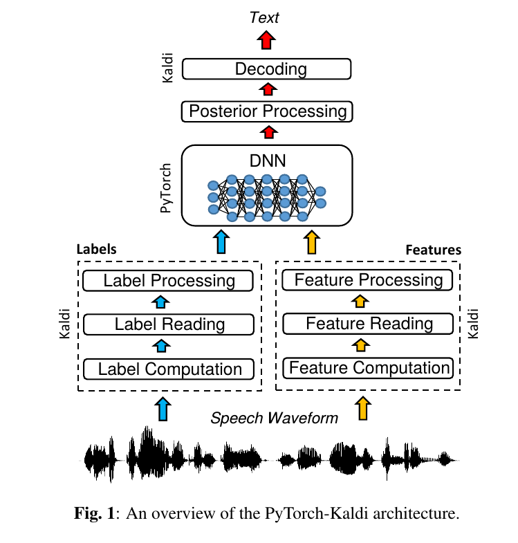
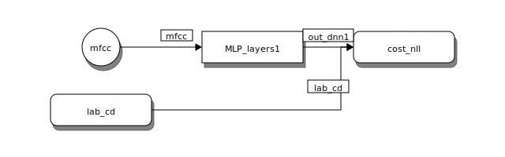
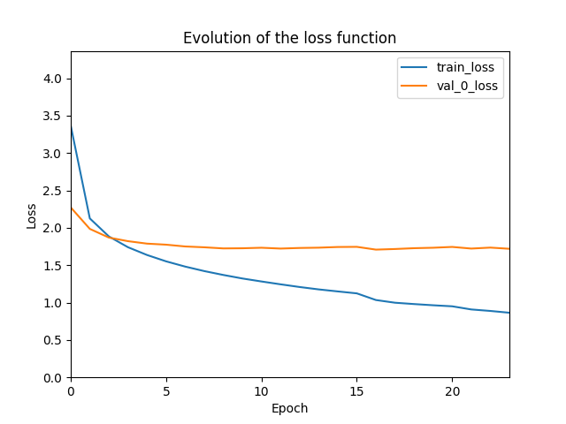

网上关于 PyTorch-Kaldi 的介绍多停留在论文翻译，很难得在李理的博客里看到例子的运行和脚本的详细说明，以下附上原文内容并附上少量注解。

**本文转载自 [李理的博客](http://fancyerii.github.io/books/pytorch-kaldi/)**

本文介绍 PyTorch-Kaldi。前面介绍过的 Kaldi 是用 C++ 和各种脚本来实现的，它不是一个通用的深度学习框架。如果要使用神经网络来梯度 GMM 的声学模型，就得自己用 C++ 代码实现神经网络的训练与预测，这显然很难实现并且容易出错。我们更加习惯使用 Tensorflow 或者 PyTorch 来实现神经网络。因此 PyTorch-Kaldi 就应运而生了，它使得我们可以利用 Kaldi 高效的特征提取、HMM 模型和基于 WFST 的解码器，同时使用我们熟悉的 PyTorch 来解决神经网络的训练和预测问题。阅读本文前需要理解 HMM-DNN 的语音识别系统、WFST和Kaldi的基本用法。

## 架构

前面我们了解了 Kaldi 的基本用法，Kaldi 最早设计是基于 HMM-GMM 架构的，后来通过引入 DNN 得到 HMM-DNN 模型。但是由于 Kaldi 并不是一个深度学习框架，我们如果想使用更加复杂的深度学习算法会很困难，我们需要修改 Kaldi 里的 C++ 代码，需要非常熟悉其代码才能实现。而且我们可能需要自己实现梯度计算，因为它不是一个 Tensorflow 或者 PyTorch 这样的框架。这样就导致想在Kaldi里尝试不同的深度学习(声学)模型非常困难。而 PyTorch-Kaldi 就是为了解决这个问题，它的架构如图<a href='#pykaldi'>下图</a>所示，它把 PyTorch 和 Kaldi 完美的结合起来，使得我们可以把精力放到怎么用 PyTorch 实现不同的声学模型，而把 PyTorch 声学模型和Kaldi复杂处理流程结合的 dirty 工作它都帮我们做好了。
 <a name='pykaldi'></a>
*图：PyTorch-Kaldi架构*

## 简介

[PyTorch-Kaldi](https://github.com/mravanelli/pytorch-kaldi) 的目的是作为 Kaldi 和 PyTorch 的一个**桥梁**，它能继承 Kaldi 的高效和 PyTorch 的灵活性。PyTorch-Kaldi 并不只是这两个工具的粘合剂，而且它还提供了用于构建现代语音识别系统的很多有用特性。比如，代码可以很容易的插入用户自定义的声学模型。此外，用户也可以利用预先实现的网络结果，通过简单的配置文件修改就可以实现不同的模型。PyTorch-Kaldi 也支持多个特征 (feature) 和标签 (label) 流的**融合**，使用复杂的网络结构。 它提供完善的文档并且可以在本地或者HPC集群上运行。

下面是最新版本的一些特性：

* 使用 Kaldi 的简单接口
* 容易插入 (plug-in) 自定义模型
* 预置许多常见模型，包括 MLP, CNN, RNN, LSTM, GRU, Li-GRU, SincNet
* 基于多种特征、标签和网络结构的复杂模型实现起来非常自然。
* 简单和灵活的配置文件
* 自动从上一次处理的块 (chunk) 恢复并继续训练
* 自动分块 (chunking) 和进行输入的上下文扩展
* 多 GPU 训练
* 可以本地或者在 HPC 机器上运行
* TIMIT 和 Librispeech 数据集的教程
  
---

## 依赖包

### Kaldi

我们首先需要安装Kaldi，读者请参考[官方文档](https://kaldi-asr.org/doc/)进行安装和学习Kaldi的基本用法。


安装好了之后需要把Kaldi的相关工具加到环境变量中，比如把下面的内容加到~/.bashrc下并且重新打开终端。
```bash
export KALDI_ROOT=/home/lili/codes/kaldi
PATH=$KALDI_ROOT/tools/openfst:$PATH
PATH=$KALDI_ROOT/src/featbin:$PATH
PATH=$KALDI_ROOT/src/gmmbin:$PATH
PATH=$KALDI_ROOT/src/bin:$PATH
PATH=$KALDI_ROOT/src/nnetbin:$PATH
export PATH
```

读者需要把 KALDI_ROOT 设置成 kaldi 的**根目录**。如果运行 `copy-feats` 能出现帮助文档，则说明安装成功。

### PyTorch

目前 PyTorch-Kaldi 在 PyTorch1.0 和 0.4 做过测试，因此建议安装这两个版本的，为了提高效率，如果有 GPU 的话一定要安装 GPU 版本的 PyTorch。

> 要保证 PyTorch 和 cuda 版本相兼容。根据经验，PyTorch 版本过新会导致 cuda 不兼容而报错。参考 [PyTorch 版本管理](https://pytorch.org/get-started/previous-versions/)。@Baileyswu

### PyTorch-Kaldi
使用下面的代码进行安装，建议使用 virtualenv 来构建一个干净隔离的环境。
```
git clone https://github.com/mravanelli/pytorch-kaldi
pip install -r requirements.txt
```
---

## TIMIT教程

### 获取数据

数据可以在[这里](https://www.kaggle.com/mfekadu/darpa-timit-acousticphonetic-continuous-speech)获取。

### 使用Kaldi进行训练

#### 原理回顾
Kaldi 是传统的 HMM-GMM，我们希望用神经网络来替代其中的 GMM 声学模型部分。声学模型可以认为是计算概率 $P(X \vert q)$，这里 q 表示HMM 的状态，而 X 是观测(比如 MFCC 特征)，但是神经网络是区分性 (discriminative) 模型，它只能计算 $P(q \vert X)$，也就是给定观察，我们可以计算它属于某个状态的概率，也就是进行分类。当然，根据贝叶斯公式：

$$
P(X | q)=\frac{P(q|X)P(X)}{P(q)} \propto \frac{P(q|X)}{P(q)}
$$

因为 P(X) 是固定的，大家都一样，所以可以忽略。但是我们还是需要除以每个状态的先验概率 $P(q)$，这个先验概率可以从训练数据中统计出来。

那现在的问题是怎么获得训练数据，因为语音识别的训练数据是一个句子 (utterance) 的录音和对应的文字。状态是我们引入 HMM 模型的一个假设，世界上并没有一个实在的物体叫 HMM 状态。因此我们需要先训练 HMM-GMM 模型，通过强制对齐 (Force-Alignment) 算法让模型标注出最可能的状态序列。对齐后就有了状态和观察的对应关系，从而可以训练 HMM-DNN 模型了，Kaldi 中的 HMM-GMM 模型也是这样的原理。我们这里可以用 PyTorch-Kaldi 替代 Kaldi 自带的 DNN 模型，从而可以引入更加复杂的神经网络模型，而且实验起来速度更快，比较 PyTorch 是专门的神经网络框架，要实现一个新的网络结构非常简单。相比之下要在 Kaldi 里用 C++ 代码实现新的神经网络就复杂和低效(这里指的是开发效率，但是运行效率也可能是 PyTorch 更快，但是这个只是我的猜测)。当然我们也可以先训练 HMM-DNN，然后用 HMM-DNN 来进行强制对齐，因为 HMM-DNN 要比 HMM-GMM 的效果好，因此它的对齐也是更加准确。

#### Kaldi训练

原理清楚了，下面我们来进行 Kaldi 的训练，但是训练前我们需要修改几个脚本。


读者如果有TIMIT数据集，在运行前需要修改一些脚本里的路径，下面是作者的修改，供参考。
首先需要修改cmd.sh，因为我是使用单机训练，所以需要把queue.pl改成run.pl。
```bash
lili@lili-Precision-7720:~/codes/kaldi/egs/timit/s5$ git diff cmd.sh
diff --git a/egs/timit/s5/cmd.sh b/egs/timit/s5/cmd.sh
index 6c6dc88..7e3d909 100644
--- a/egs/timit/s5/cmd.sh
+++ b/egs/timit/s5/cmd.sh
@@ -10,10 +10,10 @@
 # conf/queue.conf in http://kaldi-asr.org/doc/queue.html for more information,
 # or search for the string 'default_config' in utils/queue.pl or utils/slurm.pl.
 
-export train_cmd="queue.pl --mem 4G"
-export decode_cmd="queue.pl --mem 4G"
+export train_cmd="run.pl --mem 4G"
+export decode_cmd="run.pl --mem 4G"
 # the use of cuda_cmd is deprecated, used only in 'nnet1',
-export cuda_cmd="queue.pl --gpu 1"
+export cuda_cmd="run.pl --gpu 1"

```

接着修改修改 `run.sh` 里的数据路径 timit 变量修改成你自己的路径，另外我的机器CPU也不够多，因此把 `train_nj` 改小一点。

```bash
lili@lili-Precision-7720:~/codes/kaldi/egs/timit/s5$ git diff run.sh
diff --git a/egs/timit/s5/run.sh b/egs/timit/s5/run.sh
index 58bd871..5c322cc 100755
--- a/egs/timit/s5/run.sh
+++ b/egs/timit/s5/run.sh
@@ -28,7 +28,7 @@ numLeavesSGMM=7000
 numGaussSGMM=9000
 
 feats_nj=10
-train_nj=30
+train_nj=8
 decode_nj=5
 
 echo ============================================================================
@@ -36,8 +36,8 @@ echo "                Data & Lexicon & Language Preparation
 echo ============================================================================
 
 #timit=/export/corpora5/LDC/LDC93S1/timit/TIMIT # @JHU
-timit=/mnt/matylda2/data/TIMIT/timit # @BUT
-
+#timit=/mnt/matylda2/data/TIMIT/timit # @BUT
+timit=/home/lili/databak/ldc/LDC/timit/TIMIT
 local/timit_data_prep.sh $timit || exit 1
 
 local/timit_prepare_dict.sh

```

最后我们开始训练：
```bash
cd kaldi/egs/timit/s5
./run.sh
./local/nnet/run_dnn.sh
```

#### 强制对齐

我们有两种选择，第一种使用 HMM-GMM 的对齐来训练 PyTorch-Kaldi，对于这种方式，训练数据已经对齐过了(因为训练 HMM-DNN 就需要对齐)，所以只需要对开发集和测试集再进行对齐：
```bash
cd kaldi/egs/timit/s5
steps/align_fmllr.sh --nj 4 data/dev data/lang exp/tri3 exp/tri3_ali_dev
steps/align_fmllr.sh --nj 4 data/test data/lang exp/tri3 exp/tri3_ali_test
```

但是更好的是使用 HMM-DNN 来做对齐，作者使用的是这种方式，这就需要对训练集再做一次对齐了，因为之前的对齐是 HMM-GMM 做的，不是我们需要的。
```bash
steps/nnet/align.sh --nj 4 data-fmllr-tri3/train data/lang exp/dnn4_pretrain-dbn_dnn exp/dnn4_pretrain-dbn_dnn_ali
steps/nnet/align.sh --nj 4 data-fmllr-tri3/dev data/lang exp/dnn4_pretrain-dbn_dnn exp/dnn4_pretrain-dbn_dnn_ali_dev
steps/nnet/align.sh --nj 4 data-fmllr-tri3/test data/lang exp/dnn4_pretrain-dbn_dnn exp/dnn4_pretrain-dbn_dnn_ali_test
```

#### 修改PyTorch-Kaldi的配置

我们这里只介绍最简单的全连接网络(基本等价与 Kaldi 里的 DNN)，这个配置文件在 PyTorch-Kaldi 根目录下，位置是 `cfg/TIMIT_baselines/TIMIT_MLP_mfcc_basic.cfg`。从这个文件名我们可以猜测出这是使用 MFCC 特征的 MLP 模型，此外 cfg/TIMIT_baselines 目录下还有很多其它的模型。这个我们需要修改其中对齐后的目录等数据，请读者参考作者的修改进行修改。

```bash
diff --git a/cfg/TIMIT_baselines/TIMIT_MLP_mfcc_basic.cfg b/cfg/TIMIT_baselines/TIMIT_MLP_mfcc_basic.cfg
index 6f02075..6e5dc5d 100644
--- a/cfg/TIMIT_baselines/TIMIT_MLP_mfcc_basic.cfg
+++ b/cfg/TIMIT_baselines/TIMIT_MLP_mfcc_basic.cfg
@@ -15,18 +15,18 @@ n_epochs_tr = 24
 [dataset1]
 data_name = TIMIT_tr
 fea = fea_name=mfcc
-	fea_lst=/home/mirco/kaldi-trunk/egs/timit/s5/data/train/feats.scp
-	fea_opts=apply-cmvn --utt2spk=ark:/home/mirco/kaldi-trunk/egs/timit/s5/data/train/utt2spk  ark:/home/mirco/kaldi-trunk/egs/timit/s5/mfcc/cmvn_train.ark ark:- ark:- | add-deltas --delta-order=2 ark:- ark:- |
+	fea_lst=/home/lili/codes/kaldi/egs/timit/s5/data/train/feats.scp
+	fea_opts=apply-cmvn --utt2spk=ark:/home/lili/codes/kaldi/egs/timit/s5/data/train/utt2spk  ark:/home/lili/codes/kaldi/egs/timit/s5/mfcc/cmvn_train.ark ark:- ark:- | add-deltas --delta-order=2 ark:- ark:- |
 	cw_left=5
 	cw_right=5
 	
 
 lab = lab_name=lab_cd
-	lab_folder=/home/mirco/kaldi-trunk/egs/timit/s5/exp/dnn4_pretrain-dbn_dnn_ali
+	lab_folder=/home/lili/codes/kaldi/egs/timit/s5/exp/dnn4_pretrain-dbn_dnn_ali
 	lab_opts=ali-to-pdf
 	lab_count_file=auto
-	lab_data_folder=/home/mirco/kaldi-trunk/egs/timit/s5/data/train/
-	lab_graph=/home/mirco/kaldi-trunk/egs/timit/s5/exp/tri3/graph
+	lab_data_folder=/home/lili/codes/kaldi/egs/timit/s5/data/train/
+	lab_graph=/home/lili/codes/kaldi/egs/timit/s5/exp/tri3/graph
 	
 
 n_chunks = 5
@@ -34,18 +34,18 @@ n_chunks = 5
 [dataset2]
 data_name = TIMIT_dev
 fea = fea_name=mfcc
-	fea_lst=/home/mirco/kaldi-trunk/egs/timit/s5/data/dev/feats.scp
-	fea_opts=apply-cmvn --utt2spk=ark:/home/mirco/kaldi-trunk/egs/timit/s5/data/dev/utt2spk  ark:/home/mirco/kaldi-trunk/egs/timit/s5/mfcc/cmvn_dev.ark ark:- ark:- | add-deltas --delta-order=2 ark:- ark:- |
+	fea_lst=/home/lili/codes/kaldi/egs/timit/s5/data/dev/feats.scp
+	fea_opts=apply-cmvn --utt2spk=ark:/home/lili/codes/kaldi/egs/timit/s5/data/dev/utt2spk  ark:/home/lili/codes/kaldi/egs/timit/s5/mfcc/cmvn_dev.ark ark:- ark:- | add-deltas --delta-order=2 ark:- ark:- |
 	cw_left=5
 	cw_right=5
 	
 
 lab = lab_name=lab_cd
-	lab_folder=/home/mirco/kaldi-trunk/egs/timit/s5/exp/dnn4_pretrain-dbn_dnn_ali_dev
+	lab_folder=/home/lili/codes/kaldi/egs/timit/s5/exp/dnn4_pretrain-dbn_dnn_ali_dev
 	lab_opts=ali-to-pdf
 	lab_count_file=auto
-	lab_data_folder=/home/mirco/kaldi-trunk/egs/timit/s5/data/dev/
-	lab_graph=/home/mirco/kaldi-trunk/egs/timit/s5/exp/tri3/graph
+	lab_data_folder=/home/lili/codes/kaldi/egs/timit/s5/data/dev/
+	lab_graph=/home/lili/codes/kaldi/egs/timit/s5/exp/tri3/graph
 	
 
 n_chunks = 1
@@ -53,18 +53,18 @@ n_chunks = 1
 [dataset3]
 data_name = TIMIT_test
 fea = fea_name=mfcc
-	fea_lst=/home/mirco/kaldi-trunk/egs/timit/s5/data/test/feats.scp
-	fea_opts=apply-cmvn --utt2spk=ark:/home/mirco/kaldi-trunk/egs/timit/s5/data/test/utt2spk  ark:/home/mirco/kaldi-trunk/egs/timit/s5/mfcc/cmvn_test.ark ark:- ark:- | add-deltas --delta-order=2 ark:- ark:- |
+	fea_lst=/home/lili/codes/kaldi/egs/timit/s5/data/test/feats.scp
+	fea_opts=apply-cmvn --utt2spk=ark:/home/lili/codes/kaldi/egs/timit/s5/data/test/utt2spk  ark:/home/lili/codes/kaldi/egs/timit/s5/mfcc/cmvn_test.ark ark:- ark:- | add-deltas --delta-order=2 ark:- ark:- |
 	cw_left=5
 	cw_right=5
 	
 
 lab = lab_name=lab_cd
-	lab_folder=/home/mirco/kaldi-trunk/egs/timit/s5/exp/dnn4_pretrain-dbn_dnn_ali_test
+	lab_folder=/home/lili/codes/kaldi/egs/timit/s5/exp/dnn4_pretrain-dbn_dnn_ali_test
 	lab_opts=ali-to-pdf
 	lab_count_file=auto
-	lab_data_folder=/home/mirco/kaldi-trunk/egs/timit/s5/data/test/
-	lab_graph=/home/mirco/kaldi-trunk/egs/timit/s5/exp/tri3/graph
+	lab_data_folder=/home/lili/codes/kaldi/egs/timit/s5/data/test/
+	lab_graph=/home/lili/codes/kaldi/egs/timit/s5/exp/tri3/graph
 	
 
 n_chunks = 1
```

看起来有点长，其实读者只需要搜索/home/mirco/kaldi-trunk，然后都替换成你自己的kaldi的root路径就行。注意：这里一定要用绝对路径而不能是~/这种。

这个配置文件后面我们再解释其含义。

### 训练

```bash
python run_exp.py cfg/TIMIT_baselines/TIMIT_MLP_mfcc_basic.cfg
```

训练完成后会在目录 `exp/TIMIT_MLP_basic/` 下产生如下文件/目录：

* res.res

每个 Epoch 在训练集和验证集上的 loss 和 error 以及最后测试的词错误率 (WER)。作者训练后得到的词错误率是 18%，每次训练因为随机初始化不同会有一点偏差。
```bash
lili@lili-Precision-7720:~/codes/pytorch-kaldi$ tail exp/TIMIT_MLP_basic/res.res 
ep=16 tr=['TIMIT_tr'] loss=1.034 err=0.324 valid=TIMIT_dev loss=1.708 err=0.459 lr_architecture1=0.04 time(s)=43
ep=17 tr=['TIMIT_tr'] loss=0.998 err=0.315 valid=TIMIT_dev loss=1.716 err=0.458 lr_architecture1=0.04 time(s)=42
ep=18 tr=['TIMIT_tr'] loss=0.980 err=0.309 valid=TIMIT_dev loss=1.727 err=0.458 lr_architecture1=0.04 time(s)=42
ep=19 tr=['TIMIT_tr'] loss=0.964 err=0.306 valid=TIMIT_dev loss=1.733 err=0.457 lr_architecture1=0.04 time(s)=43
ep=20 tr=['TIMIT_tr'] loss=0.950 err=0.302 valid=TIMIT_dev loss=1.744 err=0.458 lr_architecture1=0.04 time(s)=45
ep=21 tr=['TIMIT_tr'] loss=0.908 err=0.290 valid=TIMIT_dev loss=1.722 err=0.452 lr_architecture1=0.02 time(s)=45
ep=22 tr=['TIMIT_tr'] loss=0.888 err=0.284 valid=TIMIT_dev loss=1.735 err=0.453 lr_architecture1=0.02 time(s)=44
ep=23 tr=['TIMIT_tr'] loss=0.864 err=0.277 valid=TIMIT_dev loss=1.719 err=0.450 lr_architecture1=0.01 time(s)=44
%WER 18.0 | 192 7215 | 84.9 11.4 3.6 2.9 18.0 99.5 | -1.324 | /home/lili/codes/pytorch-kaldi/exp/TIMIT_MLP_basic/decode_TIMIT_test_out_dnn1/score_4/ctm_39phn.filt.sys
```

* log.log

日志，包括错误和警告信息。如果出现问题，可以首先看看这个文件。

* conf.cfg

配置的一个拷贝

* model.svg

网络的结构图，如下图所示：

 
 <a name='model'></a>
*图：网络的结构图*

* exp_files目录

这个目录包含很多文件，用于描述每一个 Epoch 的训练详细信息。比如后缀为 `.info` 的文件说明块 (chunk) 的信息，后面我们会介绍什么叫块。`.cfg` 是每个快的配置信息。`.lst` 列举这个块使用的特征文件。

* generated_outputs目录
包括训练和验证的准确率和 loss 随 epoch 的变化，比如 loss 如下图所示：

 <a name='loss'></a>
*图：训练过程中loss的变化图*

### 使用其它特征

如果需要使用其它特征，比如 Filter Bank 特征，我们需要做如下的修改然后重新进行 Kalid 的训练。我们需要找到 `KALDI_ROOT/egs/timit/s5/run.sh` 然后把

```bash
mfccdir=mfcc

for x in train dev test; do
  steps/make_mfcc.sh --cmd "$train_cmd" --nj $feats_nj data/$x exp/make_mfcc/$x $mfccdir
  steps/compute_cmvn_stats.sh data/$x exp/make_mfcc/$x $mfccdir
done

```

改成：
```bash
feadir=fbank

for x in train dev test; do
  steps/make_fbank.sh --cmd "$train_cmd" --nj $feats_nj data/$x exp/make_fbank/$x $feadir
  steps/compute_cmvn_stats.sh data/$x exp/make_fbank/$x $feadir
done
```

接着修改 Pytorch-Kaldi 的配置(比如 `cfg/TIMIT_baselines/TIMIT_MLP_mfcc_basic.cfg`)，把 `fea_lst` 改成fbank特征的路径。

如果需要使用 fmllr 特征(使用了说话人自适应技术)，那么前面完整的 kaldi 脚本已经提取过了这个特征，因此不需要再次提取。如果没有运行完整的脚本，需要完整的运行它一次。

### 使用其它模型

在 `cfg/TIMIT_baselines/` 目录下还有很多模型，比如 CNN、LSTM和GRU 等，这里就不介绍了。


### 实验结果

在 TIMIT 数据集上使用不同方法的实验结果如下表所示。

| Model  | mfcc | fbank | fMLLR | 
| ------ | -----| ------| ------| 
|  Kaldi DNN Baseline | -----| ------| 18.5 |
|  MLP  | 18.2 | 18.7 | 16.7 | 
|  RNN  | 17.7 | 17.2 | 15.9 | 
|  SRU  | -----| 16.6 | -----|
|LSTM| 15.1  | 14.3  |14.5  | 
|GRU| 16.0 | 15.2|  14.9 | 
|li-GRU| **15.5**  | **14.9**|  **14.2** | 

从上表可以看出，fMLLR 比 mfcc 和 fbank 的特征效果要好，因为它使用了说话人自适应 (Speaker Adaptation) 的技术。从模型的角度来看 LSTM、GRU 比 MLP 要好，而 [Li-GRU](https://arxiv.org/pdf/1803.10225.pdf) 模型比它们还要更好一点。

如果把三个特征都融合起来，使用Li-GRU可以得到更好的结果，词错误率是13.8%。感兴趣的读者可以参考 `cfg/TIMI_baselines/TIMIT_mfcc_fbank_fmllr_liGRU_best.cfg`。


## Librispeech教程

官网还提供了Librispeech教程，这个数据集是免费的，读者可以在[这里](http://www.openslr.org/12/)下载。由于磁盘空间限制，之前我下载和训练过的Librispeech数据都删除了，所以我没有用PyTorch-Kaldi跑过，因此也就不介绍了。
但是原理都差不多，感兴趣的读者请参考[官网教程](https://github.com/mravanelli/pytorch-kaldi#librispeech-tutorial)。

---

## PyTorch-Kaldi的工作过程

最重要的是 `run_exp.py` 文件，它用来执行训练、验证、forward 和解码。训练会分成很多个 Epoch，一个 Epoch 训练完成后会在验证集上进行验证。训练结束后会执行 forward，也就是在测试数据集上根据输入特征计算后验概率 $p(q \vert X)$，这里 X 是特征(比如 mfcc)。但是为了在 HMM 里使用，我们需要似然概率 $p(X \vert q)$，因此我们还需要除以先验概率 $p(q)$。最后使用 Kaldi 来解码，输出最终的文本。注意：特征提取是Kaldi完成，前面已经做过了(包括测试集)，而计算似然 $p(X \vert q)$ 是 PyTorch-Kaldi 来完成的，最后的解码又是由 Kaldi 来做的。

`run_exp.py` 的输入是一个配置文件(比如我们前面用到的`TIMIT_MLP_mfcc_basic.cfg`)，这个配置文件包含了训练神经网络的所有参数。因为训练数据可能很大，PyTorch-Kaldi 会把整个数据集划分成更小的块 (chunk)，以便能够放到内存里训练。`run_exp.py` 会调用`run_nn` 函数(在 `core.py` 里)来训练一个块的数据，`run_nn` 函数也需要一个类似的配置文件(比如 `exp/TIMIT_MLP_basic/exp_files/train_TIMIT_tr_ep00_ck1.cfg` )。这个文件里会指明训练哪些数据(比如 `fea_lst=exp/TIMIT_MLP_basic/exp_files/train_TIMIT_tr_ep00_ck1_mfcc.lst`)，同时训练结果比如 loss 等信息也会输出到 info 文件里(比如 `exp/TIMIT_MLP_basic/exp_files/train_TIMIT_tr_ep00_ck1.info`)。

比如作者训练时 `exp/TIMIT_MLP_basic/exp_files/train_TIMIT_tr_ep00_ck1_mfcc.lst` 的内容如下：

```bash
$ head exp/TIMIT_MLP_basic/exp_files/train_TIMIT_tr_ep00_ck1_mfcc.lst
MAEB0_SX450 /home/lili/codes/kaldi/egs/timit/s5/mfcc/raw_mfcc_train.4.ark:32153
MRWA0_SX163 /home/lili/codes/kaldi/egs/timit/s5/mfcc/raw_mfcc_train.9.ark:862231
MMGC0_SI1935 /home/lili/codes/kaldi/egs/timit/s5/mfcc/raw_mfcc_train.8.ark:15925
MRLJ1_SI2301 /home/lili/codes/kaldi/egs/timit/s5/mfcc/raw_mfcc_train.9.ark:355566
MRJB1_SX390 /home/lili/codes/kaldi/egs/timit/s5/mfcc/raw_mfcc_train.9.ark:109739
FLAC0_SX361 /home/lili/codes/kaldi/egs/timit/s5/mfcc/raw_mfcc_train.2.ark:786772
FMBG0_SI1790 /home/lili/codes/kaldi/egs/timit/s5/mfcc/raw_mfcc_train.2.ark:1266225
FTBW0_SX85 /home/lili/codes/kaldi/egs/timit/s5/mfcc/raw_mfcc_train.3.ark:1273832
MDDC0_SX339 /home/lili/codes/kaldi/egs/timit/s5/mfcc/raw_mfcc_train.4.ark:1427498
FPAF0_SX244 /home/lili/codes/kaldi/egs/timit/s5/mfcc/raw_mfcc_train.3.ark:207223
```

`exp/TIMIT_MLP_basic/exp_files/train_TIMIT_tr_ep00_ck1.info` 的内容如下：
```bash
$ cat exp/TIMIT_MLP_basic/exp_files/train_TIMIT_tr_ep00_ck1.info
[results]
loss=3.6573577
err=0.7678323
elapsed_time_chunk=8.613296

```

---
## 配置文件

这里有两种配置文件：全局的配置文件(比如cfg/TIMIT_baselines/TIMIT_MLP_mfcc_basic.cfg)和块的配置文件(比如exp/TIMIT_MLP_basic/exp_files/train_TIMIT_tr_ep00_ck1.cfg)。它们都是ini文件，使用configparser库来parse。全局配置文件包含很多节(section，在ini文件里用[section-name]开始一个section)，它说明了训练、验证、forward和解码的过程。块配置文件和全局配置文件很类似，我们先介绍全局配置文件，这里以cfg/TIMIT_baselines/TIMIT_MLP_mfcc_basic.cfg为例。


### cfg_proto
```
[cfg_proto]
cfg_proto = proto/global.proto
cfg_proto_chunk = proto/global_chunk.proto
```
cfg_proto节指明全局配置文件和块配置文件的结构，我们看一下proto/global.proto

```
[cfg_proto]
cfg_proto=path
cfg_proto_chunk=path

[exp]
cmd=str
run_nn_script=str
out_folder=str
seed=int(-inf,inf)
use_cuda=bool
multi_gpu=bool
save_gpumem=bool
N_epochs_tr=int(1,inf)
```

这个 `global.proto` 可以认为定义了 `TIMIT_MLP_mfcc_basic.cfg` 的结构 (schema)。比如它定义了 `cfg_proto` 节有两个配置项：`cfg_proto` 和 `cfg_proto_chunk`，它们的值是 path(路径)。因此我们在 `TIMIT_MLP_mfcc_basic.cfg` 的 `cfg_proto` 节只能配置 `cfg_proto` 和 `cfg_proto_chunk`。

类似的，`global.proto` 定义了 `exp` 节包含 `cmd`，它是一个字符串；`seed`，它是一个负无穷(-inf)到无穷(inf)的整数；`N_epochs_tr`，它是一个1到无穷的整数。

因此我们可以在 `TIMIT_MLP_mfcc_basic.cfg` 里做如下定义：

```
[exp]
cmd = 
run_nn_script = run_nn
out_folder = exp/TIMIT_MLP_basic
seed = 1234
use_cuda = True
multi_gpu = False
save_gpumem = False
n_epochs_tr = 24

```

exp 节是实验的一些全局配置。这些配置的含义我们大致可以猜测出来：cmd是分布式训练时的脚本，我们这里设置为空即可；run_nn_script 是块的训练函数，这里是 run_nn(core.py)；out_folder 是实验的输出目录；seed 是随机种子；use_cuda 是否使用 CUDA；multi-gpu 表示是否多 GPU 训练；n_epochs_tr 表示训练的 epoch 数。


我们这里需要修改的一般就是 use_cuda，如果没有 GPU 则需要把它改成False。下面我们只介绍 `TIMIT_MLP_mfcc_basic.cfg` 的各个节，它的结构就不介绍了。

### dataset

`dataset` 用于配置数据，我们这里配置训练、验证和测试3个数据集，分别用 dataset1、dataset2 和 dataset3 表示：

```
[dataset1]
data_name = TIMIT_tr
fea = fea_name=mfcc
	fea_lst=/home/lili/codes/kaldi/egs/timit/s5/data/train/feats.scp
	fea_opts=apply-cmvn --utt2spk=ark:/home/lili/codes/kaldi/egs/timit/s5/data/train/utt2spk  ark:/home/lili/codes/kaldi/egs/timit/s5/mfcc/cmvn_train.ark ark:- ark:- | add-deltas --delta-order=2 ark:- ark:- |
	cw_left=5
	cw_right=5
	

lab = lab_name=lab_cd
	lab_folder=/home/lili/codes/kaldi/egs/timit/s5/exp/dnn4_pretrain-dbn_dnn_ali
	lab_opts=ali-to-pdf
	lab_count_file=auto
	lab_data_folder=/home/lili/codes/kaldi/egs/timit/s5/data/train/
	lab_graph=/home/lili/codes/kaldi/egs/timit/s5/exp/tri3/graph
	

n_chunks = 5

[dataset2]
data_name = TIMIT_dev
fea = fea_name=mfcc
	fea_lst=/home/lili/codes/kaldi/egs/timit/s5/data/dev/feats.scp
	fea_opts=apply-cmvn --utt2spk=ark:/home/lili/codes/kaldi/egs/timit/s5/data/dev/utt2spk  ark:/home/lili/codes/kaldi/egs/timit/s5/mfcc/cmvn_dev.ark ark:- ark:- | add-deltas --delta-order=2 ark:- ark:- |
	cw_left=5
	cw_right=5
	

lab = lab_name=lab_cd
	lab_folder=/home/lili/codes/kaldi/egs/timit/s5/exp/dnn4_pretrain-dbn_dnn_ali_dev
	lab_opts=ali-to-pdf
	lab_count_file=auto
	lab_data_folder=/home/lili/codes/kaldi/egs/timit/s5/data/dev/
	lab_graph=/home/lili/codes/kaldi/egs/timit/s5/exp/tri3/graph
	

n_chunks = 1

[dataset3]
data_name = TIMIT_test
fea = fea_name=mfcc
	fea_lst=/home/lili/codes/kaldi/egs/timit/s5/data/test/feats.scp
	fea_opts=apply-cmvn --utt2spk=ark:/home/lili/codes/kaldi/egs/timit/s5/data/test/utt2spk  ark:/home/lili/codes/kaldi/egs/timit/s5/mfcc/cmvn_test.ark ark:- ark:- | add-deltas --delta-order=2 ark:- ark:- |
	cw_left=5
	cw_right=5
	

lab = lab_name=lab_cd
	lab_folder=/home/lili/codes/kaldi/egs/timit/s5/exp/dnn4_pretrain-dbn_dnn_ali_test
	lab_opts=ali-to-pdf
	lab_count_file=auto
	lab_data_folder=/home/lili/codes/kaldi/egs/timit/s5/data/test/
	lab_graph=/home/lili/codes/kaldi/egs/timit/s5/exp/tri3/graph
	

n_chunks = 1
```

每个 `dataset` 有一个名字，比如 `TIMIT_tr`。接下来是 `fea`，它用来配置特征(神经网络的输入)，这个配置又有很多子配置项。`fea_name` 给它起个名字。而 `fea_lst` 表示特征 `scp` 文件。它指明每个 `utterance` 对应的特征在 `ark` 文件里的位置，不熟悉的读者请参考 `Kaldi` 文档或者本书前面的内容。`fea_opts` 表示对原始的特征文件执行的一些命令，比如 `apply-cmvn` 表示对原始的 MFCC 特征进行均值和方差的归一化。`cw_left` 和 `cw_right=5` 表示除了当前帧，我们还使用左右各 5 帧也就是共 11 帧的特征来预测。使用当前帧左右的数据这对于MLP来说是很有效的，但是对于 LSTM 或者 GRU 来说是不必要的，比如在 `cfg/TIMIT_baselines/TIMIT_LSTM_mfcc.cfg` 里 `cw_left=0`。

而 lab 用来配置标签(上下文相关因子是 PyTorch-Kaldi 的输出)，它也有很多子配置项。lab_name 是名字，lab_folder 指定对齐结果的目录。 "lab_opts=ali-to-pdf" 表示使用标准的上下文相关的因子表示(cd phone,contextual dependent phone)；如果我们不想考虑上下文(训练数据很少的时候)可以使用 "`lab_opts=ali-to-phones --per-frame=true`"。lab_count_file 是用于指定因子的先验概率的文件，auto 让 PyTorch-Kaldi 自己去计算。lab_data_folder 指明数据的位置，注意它是 kaldi 数据的位置，而不是 PyTorch-Kaldi 的数据。

因为训练数据通常很大，不能全部放到内存里，因此我们需要用 n_chunks 把所有数据切分成 n_chunks 个块。这里因为 TIMIT 不大，所以只需要分成 5 个块。而验证和测试的时候数据量不大，所以 n_chunks=1，也就是全部放到内存。如果我们看 Librispeech 的配置，因为它的数据比较大，所以它配置成 N_chunks=50。

通常我们让一个块包含 1 到 2 个小时的语音数据。

### data_use

```
[data_use]
train_with = TIMIT_tr
valid_with = TIMIT_dev
forward_with = TIMIT_test
```

data_use 指定训练、验证和 forward (其实就是测试)使用的数据集的名字，TIMIT_tr、TIMIT_dev 和 TIMIT_test 就是我们之前在dataset里定义的。

### batches

```
batch_size_train = 128
max_seq_length_train = 1000
increase_seq_length_train = False
start_seq_len_train = 100
multply_factor_seq_len_train = 2
batch_size_valid = 128
max_seq_length_valid = 1000
```

`batch_size_train` 指定训练的 batch 大小。`max_seq_length_train` 配置最大的句子长度，如果太长，LSTM 等模型可能会内存不足从而出现OOM的问题。我们也可以逐步增加句子的长度，先让模型学习比较短的上下文，然后逐步增加长度。如果这样，我们可以设置 `increase_seq_length_train` 为 True，这个时候第一个 epoch 的最大长度会设置成 `start_seq_len_train` (100)，然后第二个 epoch 设置成 `start_seq_len_train * multply_factor_seq_len_train`(200)，……，直到 `max_seq_length_train`。这样的好处是先学习比较短的上下文，然后学习较长的上下文依赖。实验发现这种策略可以提高模型的学习效率。

类似的 `batch_size_valid` 和 `max_seq_length_valid` 指定验证集的batch大小和最大句子长度。

### architecture

```
[architecture1]
arch_name = MLP_layers1
arch_proto = proto/MLP.proto
arch_library = neural_networks
arch_class = MLP
arch_pretrain_file = none
arch_freeze = False
arch_seq_model = False
dnn_lay = 1024,1024,1024,1024,N_out_lab_cd
dnn_drop = 0.15,0.15,0.15,0.15,0.0
dnn_use_laynorm_inp = False
dnn_use_batchnorm_inp = False
dnn_use_batchnorm = True,True,True,True,False
dnn_use_laynorm = False,False,False,False,False
dnn_act = relu,relu,relu,relu,softmax
arch_lr = 0.08
arch_halving_factor = 0.5
arch_improvement_threshold = 0.001
arch_opt = sgd
opt_momentum = 0.0
opt_weight_decay = 0.0
opt_dampening = 0.0
opt_nesterov = False
```

architecture 定义神经网络模型(的超参数)。arch_name 就是起一个名字，后面会用到。

arch_proto 指定网络结构的定义 (schema) 为文件 `proto/MLP.proto`。因为不同的神经网络需要不同的配置，所以这里还需要通过arch_proto 引入不同网络的配置。而 global.proto 里只定义所有网络模型都会用到的配置，这些配置都是以 arch_ 开头。我们先看这些 arch_ 开头的配置，然后再看 MLP.proto 新引入的与特定网络相关的配置(MLP.proto 里的配置都是 dnn_ 开头)。

* arch_name 名字
* arch_proto 具体的网络proto路径
* arch_library 实现这个网络的Python类所在的文件

  比如MLP类是在neural_networks.py里实现的。

* arch_class 实现这个网络的类(PyTorch 的 nn.Module的子类)，这里是MLP。

   注意：`neural_networks.py` 除了实现 MLP 还实现其它网络结果比如 LSTM。arch_library 和 arch_class 就告诉了 PyTorch 使用那个模块的哪个类来定义神经网络。

* arch_pretrain_file 用于指定之前预训练的模型的路径

比如我先训练一个两层的MLP，然后再训练三层的时候可以使用之前的参数作为初始值。

* arch_freeze 训练模型时是否固定(freeze)参数

这看起来似乎没什么用，毕竟我们训练模型不就是为了调整参数吗？我也不是特别明白，也许是多个模型融合时我们可以先固定一个然后训练另一个？或者是我们固定预训练的arch_pretrain_file中的参数，只训练后面新加的模型的参数？

* arch_seq_model 是否序列模型

 这个参数告诉 PyTorch 你的模型是否序列模型，如果是多个模型的融合的话，只要有一个序列模型(比如 LSTM)，那么整个模型都是序列模型。如果不是序列模型的话，给神经网络的训练数据就不用给一个序列，这样它可以随机的打散一个句子的多个因子，从而每次训练这个句子都不太一样，这样效果会更好一点。但是如果是序列模型，那么给定的句子就必须是真正的序列。

* arch_lr learning rate

* arch_halving_factor 0.5

 如果当前 epoch 比前一个 epoch 在验证集上的提高小于arch_improvement_threshold，则把 learning rate 乘以arch_halving_factor(0.5)，也就是减小 learning rate。

* arch_improvement_threshold

  参考上面的说明。

* arch_opt sgd 优化算法

接下来的 opt_ 开头的参数是 sgd 的一些子配置，它的定义在 proto/sgd.proto。不同的优化算法有不同的子配置项目，比如 proto/sgd.proto如下：
```
[proto]
opt_momentum=float(0,inf)
opt_weight_decay=float(0,inf)
opt_dampening=float(0,inf)
opt_nesterov=bool
```

从名字我们可以猜测，opt_momentum 是冲量的大小，我们这里配置是 0，因此就是没有冲量的最普通的 sgd。opt_weight_decay 是 weight_decay 的权重。opt_nesterov 说明是否 nesterov 冲量。opt_dampening 我不知道是什么，我只搜索到[这个ISSUE](https://github.com/pytorch/pytorch/issues/6)，似乎是一个需要废弃的东西，[sgd的文档](https://pytorch.org/docs/stable/_modules/torch/optim/sgd.html)好像也能看到 dampening。关于优化算法，读者可以参考基础篇或者参考[cs231n的note](http://cs231n.github.io/neural-networks-3/#update)


看完了通用的 architecture 配置，我们再来看 MLP.proto 里的具体的网络配置：

```
dnn_lay = 1024,1024,1024,1024,N_out_lab_cd
dnn_drop = 0.15,0.15,0.15,0.15,0.0
dnn_use_laynorm_inp = False
dnn_use_batchnorm_inp = False
dnn_use_batchnorm = True,True,True,True,False
dnn_use_laynorm = False,False,False,False,False
dnn_act = relu,relu,relu,relu,softmax
```
我们可以从名字中猜测出来它们的含义(如果猜不出来就只能看源代码了，位置在 neural_networks.py 的MLP类)。dnn_lay 定义了5个全连接层，前4层的隐单元个数是1024，而最后一层的个数是一个特殊的 N_out_lab_cd，它表示上下文相关的因子的数量，也就是分类器的分类个数。dnn_drop 表示这 5 层的 dropout。dnn_use_laynorm_inp 表示是否对输入进行 layernorm，dnn_use_batchnorm_inp 表示是否对输入进行batchnorm。dnn_use_batchnorm 表示对 5 个全连接层是否使用 batchnorm。dnn_use_laynorm 表示对5个全连接层是否使用 layernorm。dnn_act表示每一层的激活函数，除了最后一层是 softmax，前面 4 层都是 relu。

### model
```
[model]
model_proto = proto/model.proto
model = out_dnn1=compute(MLP_layers1,mfcc)
	loss_final=cost_nll(out_dnn1,lab_cd)
	err_final=cost_err(out_dnn1,lab_cd)
```
model 定义输出和损失函数，out_dnn1=compute(MLP_layers,mfcc) 的意思是把 mfcc 特征(前面的section定义过)输入 MLP_layers1(前面定义的architecture)，从而计算出分类的概率(softmax)，把它记为 out_dnn1，然后用 out_dnn1 和 lab_cd 计算交叉熵损失函数 (cost_nll)，同时也计算错误率 (cost_err)。当然这个配置文件的 model 比较简单，我们看一个比较复杂的例子 (cfg/TIMIT_baselines/TIMIT_mfcc_fbank_fmllr_liGRU_best.cfg)：
```
[model]
model_proto=proto/model.proto
model:conc1=concatenate(mfcc,fbank)
      conc2=concatenate(conc1,fmllr)
      out_dnn1=compute(MLP_layers_first,conc2)
      out_dnn2=compute(liGRU_layers,out_dnn1)
      out_dnn3=compute(MLP_layers_second,out_dnn2)
      out_dnn4=compute(MLP_layers_last,out_dnn3)
      out_dnn5=compute(MLP_layers_last2,out_dnn3)
      loss_mono=cost_nll(out_dnn5,lab_mono)
      loss_mono_w=mult_constant(loss_mono,1.0)
      loss_cd=cost_nll(out_dnn4,lab_cd)
      loss_final=sum(loss_cd,loss_mono_w)
      err_final=cost_err(out_dnn4,lab_cd)
```

在上面的例子里，我们把 mfcc、fbank 和 fmllr 特征拼接成一个大的特征，然后使用一个 MLP_layers_first(这是一个全连接层)，然后再使用 liGRU(liGRU_layers)，然后再加一个全连接层得到 out_dnn3。out_dnn3 再用 MLP_layers_last 得到上下文相关因子的分类(MLP_layers_last 的输出是 N_out_lab_cd)；out_dnn 用 out_dnn4 得到上下文无关的因子分类(MLP_layers_last2 的输出是 N_out_lab_mono)。最后计算两个 loss_mono 和 loss_cd 然后把它们加权求和起来得到 loss_final。

### forward

```
[forward]
forward_out = out_dnn1
normalize_posteriors = True
normalize_with_counts_from = lab_cd
save_out_file = False
require_decoding = True
```

forward 定义 forward 过程的参数，首先通过 forward_out 指定输出是 out_dnn1，也就是 softmax 分类概率的输出。normalize_posteriors 为 True 说明要把后验概率归一化成似然概率。normalize_with_counts_from 指定 lab_cd，这是在前面的 dataset3 里定义的 lab_name。

save_out_file 为 False 说明后验概率文件不用时会删掉，如果调试的话可以设置为 True。require_decoding 指定是否需要对输出进行解码，我们这里是需要的。

### decoding

```
[decoding]
decoding_script_folder = kaldi_decoding_scripts/
decoding_script = decode_dnn.sh
decoding_proto = proto/decoding.proto
min_active = 200
max_active = 7000
max_mem = 50000000
beam = 13.0
latbeam = 8.0
acwt = 0.2
max_arcs = -1
skip_scoring = false
scoring_script = local/score.sh
scoring_opts = "--min-lmwt 1 --max-lmwt 10"
norm_vars = False
```

decoding 设置解码器的参数，我们这里就不解释了，读者可以参考 Kaldi的文档或者本书前面介绍的相关内容。


### 块配置文件

块配置文件和全局配置文件非常类似，它是 run_nn 在训练一个块的数据时的配置，它有一个配置 to_do={train, valid, forward}，用来说明当前的配置是训练、验证还是 forward(测试)。

---

## 自己用PyTorch实现神经网络(声学模型)

我们可以参考 neural_networks.py 的 MLP 实现自己的网络模型。

### 创建proto文件

比如创建 proto/myDNN.proto，在这里定义模型的超参数。我们可以参考 MLP.proto，它的内容如下(前面介绍过了)：
```
[proto]
dnn_lay=str_list
dnn_drop=float_list(0.0,1.0)
dnn_use_laynorm_inp=bool
dnn_use_batchnorm_inp=bool
dnn_use_batchnorm=bool_list
dnn_use_laynorm=bool_list
dnn_act=str_list
```

dnn_lay 是一个字符串的 list，用逗号分开，比如我们前面的配置：dnn_lay = 1024,1024,1024,1024,N_out_lab_cd。其余的类似。bool 表示取值只能是 True 或者 False。float_list(0.0,1.0) 表示这是一个浮点数的 list，并且每一个值的范围都是必须在 (0, 1) 之间。

### 实现

我们可以参考 neural_networks.py 的 MLP 类。我们需要实现 `__init__` 和 forward 两个方法。`__init__` 有两个参数：options 表示参数，也就是 PyTorch-Kaldi 自动从前面的配置文件里提取的参数，比如 dnn_lay 等；另一个参数是 inp_dim，表示输入的大小(不包含 batch 维)。

我们下面来简单的看一下MLP是怎么实现的。

#### \_\_init\_\_

```py
class MLP(nn.Module):
    def __init__(self, options,inp_dim):
        super(MLP, self).__init__()
        
        self.input_dim=inp_dim
        self.dnn_lay=list(map(int, options['dnn_lay'].split(',')))
        self.dnn_drop=list(map(float, options['dnn_drop'].split(','))) 
        self.dnn_use_batchnorm=list(map(strtobool, options['dnn_use_batchnorm'].split(',')))
        self.dnn_use_laynorm=list(map(strtobool, options['dnn_use_laynorm'].split(','))) 
        self.dnn_use_laynorm_inp=strtobool(options['dnn_use_laynorm_inp'])
        self.dnn_use_batchnorm_inp=strtobool(options['dnn_use_batchnorm_inp'])
        self.dnn_act=options['dnn_act'].split(',')
        
       
        self.wx  = nn.ModuleList([])
        self.bn  = nn.ModuleList([])
        self.ln  = nn.ModuleList([])
        self.act = nn.ModuleList([])
        self.drop = nn.ModuleList([])
       
  
        # input layer normalization
        if self.dnn_use_laynorm_inp:
           self.ln0=LayerNorm(self.input_dim)
          
        # input batch normalization    
        if self.dnn_use_batchnorm_inp:
           self.bn0=nn.BatchNorm1d(self.input_dim,momentum=0.05)
           
           
        self.N_dnn_lay=len(self.dnn_lay)
             
        current_input=self.input_dim
        
        # Initialization of hidden layers
        
        for i in range(self.N_dnn_lay):
            
             # dropout
             self.drop.append(nn.Dropout(p=self.dnn_drop[i]))
             
             # activation
             self.act.append(act_fun(self.dnn_act[i]))
             
             
             add_bias=True
             
             # layer norm initialization
             self.ln.append(LayerNorm(self.dnn_lay[i]))
             self.bn.append(nn.BatchNorm1d(self.dnn_lay[i],momentum=0.05))
             
             if self.dnn_use_laynorm[i] or self.dnn_use_batchnorm[i]:
                 add_bias=False
             
                  
             # Linear operations
             self.wx.append(nn.Linear(current_input, self.dnn_lay[i],bias=add_bias))
             
             # weight initialization
             self.wx[i].weight = torch.nn.Parameter(torch.Tensor(self.dnn_lay[i],current_input).
		uniform_(-np.sqrt(0.01/(current_input+self.dnn_lay[i])),
			np.sqrt(0.01/(current_input+self.dnn_lay[i]))))
             self.wx[i].bias = torch.nn.Parameter(torch.zeros(self.dnn_lay[i]))
             
             current_input=self.dnn_lay[i]
             
        self.out_dim=current_input
```

代码很长，但是其实很简单，首先从 options 里提取一些参数，比如`self.dnn_lay=list(map(int, options['dnn_lay'].split(',')))`，就可以知道每一层的大小。

然后是根据每一层的配置分别构造线性层、BatchNorm、LayerNorm、激活函数和 Dropout，保存到 `self.wx`、`self.bn`、`self.ln`、`self.act` 和 `self.drop`这 5 个 `nn.ModuleList`里。

#### forward
```py
    def forward(self, x):
        
      # Applying Layer/Batch Norm
      if bool(self.dnn_use_laynorm_inp):
        x=self.ln0((x))
        
      if bool(self.dnn_use_batchnorm_inp):

        x=self.bn0((x))
        
      for i in range(self.N_dnn_lay):
           
          if self.dnn_use_laynorm[i] and not(self.dnn_use_batchnorm[i]):
           x = self.drop[i](self.act[i](self.ln[i](self.wx[i](x))))
          
          if self.dnn_use_batchnorm[i] and not(self.dnn_use_laynorm[i]):
           x = self.drop[i](self.act[i](self.bn[i](self.wx[i](x))))
           
          if self.dnn_use_batchnorm[i]==True and self.dnn_use_laynorm[i]==True:
           x = self.drop[i](self.act[i](self.bn[i](self.ln[i](self.wx[i](x)))))
          
          if self.dnn_use_batchnorm[i]==False and self.dnn_use_laynorm[i]==False:
           x = self.drop[i](self.act[i](self.wx[i](x)))
            
          
      return x
```

forward 就用前面定义的 Module 来计算，代码非常简单。不熟悉 PyTorch 的读者可以参考官方文档。

### 在配置文件里使用我们自定义的网络

我们这里假设 myDNN 的实现和 MLP 完全一样，那么配置也是类似的，我们可以基于 `cfg/TIMIT_baselines/TIMIT_MLP_mfcc_basic.cfg` 进行简单的修改：

```
[architecture1]
arch_name= mynetwork
arch_library=neural_networks # 假设myDNN类也放在neural_networks.py里
arch_class=myDNN 
arch_seq_model=False # 我们的模型是非序列的
...

# 下面的配置和MLP完全一样，如果我们实现的网络有不同的结构或者超参数，那么我们应该知道怎么设置它们
dnn_lay=1024,1024,1024,1024,1024,N_out_lab_cd
dnn_drop=0.15,0.15,0.15,0.15,0.15,0.0
dnn_use_laynorm_inp=False
dnn_use_batchnorm_inp=False
dnn_use_batchnorm=True,True,True,True,True,False
dnn_use_laynorm=False,False,False,False,False,False
dnn_act=relu,relu,relu,relu,relu,softmax

```

其余的配置都不变就行了，我们把这个文件另存为 `cfg/myDNN_exp.cfg`。

### 训练
```bash
python run_exp.sh cfg/myDNN_exp.cfg
```

如果出现问题，我们首先可以去查看 `log.log` 的错误信息。

---

## 超参数搜索

我们通常需要尝试很多种超参数的组合来获得最好的模型，一种常见的超参数搜索方法就是随机搜索。我们当然可以自己设置各种超参数的组合，但是这比较麻烦，PyTorch-Kaldi 提供工具随机自动生成不同超参数的配置文件，`tune_hyperparameters.py` 就是用于这个目的。

```bash
python tune_hyperparameters.py cfg/TIMIT_MLP_mfcc.cfg exp/TIMIT_MLP_mfcc_tuning 10 arch_lr=randfloat(0.001,0.01) batch_size_train=randint(32,256) dnn_act=choose_str{relu,relu,relu,relu,softmax|tanh,tanh,tanh,tanh,softmax}

```

第一个参数 `cfg/TIMIT_MLP_mfcc.cfg` 是一个参考的"模板"配置，而第二个参数 `exp/TIMIT_MLP_mfcc_tuning` 是一个目录，用于存放生成的配置文件。

第三个参数 10 表示需要生成 10 个配置文件。后面的参数说明随机哪些配置项。

比如 `arch_lr=randfloat(0.001,0.01)` 表示 learning rate 用 (0.001, 0.01) 直接均匀分布的随机数产生。

`dnn_act=choose_str{relu,relu,relu,relu,softmax\|tanh,tanh,tanh,tanh,softmax}` 表示激活函数从"relu,relu,relu,relu,softmax"和"tanh,tanh,tanh,tanh,softmax"里随机选择。

---

## 使用自己的数据集

使用自己的数据集可以参考前面的TIMIT或者LibriSpeech示例，我们通常需要如下步骤：

* 准备Kaldi脚本，请参考Kaldi官方文档。

* 使用Kaldi对训练、验证和测试数据做强制对齐。

* 创建一个 PyTorch-Kaldi 的配置文件 cfg_file

* 训练 python run_exp.sh $cfg_file

---

## 使用自定义的特征

PyTorch-Kaldi 支持 Kaldi 的 ark 格式的特征文件，如果想加入自己的特征，需要保存为 ark 格式。读者可以参考 [kaldi-io-for-python](https://github.com/vesis84/kaldi-io-for-python) 来实现怎么把 numpy(特征当然就是一些向量了) 转换成 ark 格式的特征文件。也可以参考 `save_raw_fea.py`，这个脚本把原始的特征转换成 ark 格式，然后用于后续的神经网络训练。


## Batch大小、learning rate和dropout的调度

我们通常需要根据训练的进度动态的调整learning rate等超参数，PyTorch-Kaldi最新版本提供了灵活方便的配置方式，比如：

```
batch_size_train = 128*12 | 64*10 | 32*2
```
上面配置的意思是训练的时候前12个epoch使用128的batch，然后10个epoch使用大小64的batch，最后两个epoch的batch大小是32。

类似的，我们可以定义 learning rate：
```
arch_lr = 0.08*10|0.04*5|0.02*3|0.01*2|0.005*2|0.0025*2
```

它表示前10个epoch的learning rate是0.08，接下来的5个epoch是0.04，然后用0.02训练3个epoch，……。

dnn的dropout可以如下的方式表示：

```
dnn_drop = 0.15*12|0.20*12,0.15,0.15*10|0.20*14,0.15,0.0
```

这是用逗号分开配置的 5 个全连接层的 dropout，对于第一层来说，前 12 个 epoch 的 dropout 是 0.15 后 12 个是 0.20。第二层的 dropout 一直是 0.15。第三层的前 10 个 epoch 的 dropout 是 0.15 后 14 个 epoch 是 0.20，……。

---

## 不足


目前 PyTorch-Kaldi 最大的问题无法实现 online 的 Decoder，因此只能做 offline 的语音识别。具体细节感兴趣的读者请参考[这个ISSUE](https://github.com/mravanelli/pytorch-kaldi/issues/56)，可能在未来的版本里会增加online decoding的支持。


