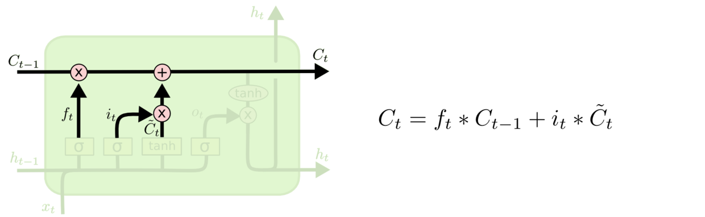
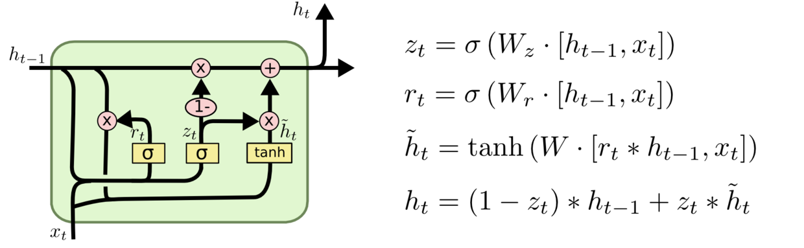

循环神经网络（Recurrent Neural Networks）是一类可以挖掘时序信息的深度网络模型。它的特点是：在隐藏层上的节点相互连接。因为一般的网络，在隐藏层上往往是不连接的。


如图，输入层是 $x$ ，输出层是 $o$， 中间的隐藏层 $s$ 会有前后时刻相关的性质，表达式为：
$$
s_t = f(Ux_{t}+Ws_{t-1})
$$

在反向传播时，会发现 $s_t, s_{t+1}, o_t$ 都会对 $x_t$ 有影响。因此，RNN 是时间维度上的深度模型。

用途：词向量表达，语句合法性检查，词性标注，机器翻译，语音识别等。

## Simple RNN (SRN)
即以上增加 $s_{t-1}$ 到 $s_t$ 的变化关系的简单循环神经网络。$s_t$ 也被认为是上下文单元。

## Bidirectional RNN (Bi-RNN)

增加了 $s_{t-1}$ 到 $s_t$ 和 $s_{t}$ 到 $s_{t-1}$ 的双向关系。因为在人日常会话等过程中，往往会把前文的有效信息传递给后文。在训练数据时，我们也可以倒过来输入数据，把后文中的数据传递给前文。这样，我们对前半部分的数据会估计得更加准确。

## Long Short-Term Memory (LSTM)

LSTM 可以对更长久的前文信息进行处理，并设置了三种门：输入门（input gate）、输出门（output gate）和遗忘门（forget gate）。最特别的是遗忘门。


乍看很像电路图，布满了各种逻辑门。从某种意义上来说网络图和电路图确实存在某种相关性。从输入结点 $x_t$ 出发，它和 $h_{t-1}$ 共同经过四种不同的逻辑单元，得到下一层的 $h_t$，并附带产生了 $o_t$. 在单元之间传递信息时，又增加了 $C_t$，可以将其看做是另一组隐变量，用于存储信息。



通过四个逻辑门和后面的组合，可以得到
$$
\begin{aligned} 
f_{t} &=\sigma\left(W_{f} \cdot\left[h_{t-1}, x_{t}\right]+b_{f}\right)  &\text{forget gate} \\
i_{t} &=\sigma\left(W_{i} \cdot\left[h_{t-1}, x_{t}\right]+b_{i}\right) &\text{input gate} \\ 
\tilde{C}_{t} &=\tanh \left(W_{C} \cdot\left[h_{t-1}, x_{t}\right]+b_{C}\right) \\
C_{t} &=f_{t} * C_{t-1}+i_{t} * \tilde{C}_{t} &\text{update cell}\\
o_{t} &=\sigma\left(W_{o}\left[h_{t-1}, x_{t}\right]+b_{o}\right) &\text{output gate} \\
h_{t} &=o_{t} * \tanh \left(C_{t}\right) &\text{recurrent}
\end{aligned}
$$

## Gated Recurrent Unit (GRU)
GRU 沿用了 LSTM 的思路，将 input gate 和 forget gate 合并为 update gate，$h_t$ 和 $C_t$ 合并为 $h_t$.


$$
\begin{aligned} z_{t} &=\sigma\left(W_{z} \cdot\left[h_{t-1}, x_{t}\right]\right) \\ r_{t} &=\sigma\left(W_{r} \cdot\left[h_{t-1}, x_{t}\right]\right) \\ \tilde{h}_{t} &=\tanh \left(W \cdot\left[r_{t} * h_{t-1}, x_{t}\right]\right) \\ h_{t} &=\left(1-z_{t}\right) * h_{t-1}+z_{t} * \tilde{h}_{t} \end{aligned}
$$

## Used in PyTorch

在 PyTorch 中很容易调用这些 RNN.

### LSTM

See [LSTM doc in pytorch](https://pytorch.org/docs/stable/nn.html?highlight=lstm#torch.nn.LSTM)  
```py
rnn = nn.LSTM(10, 20, 2)    # (input_size, hidden_size, num_layers)
input = torch.randn(5, 3, 10) # (seq_len, batch, input_size)
h0 = torch.randn(2, 3, 20)  # (num_layers * num_directions, batch, hidden_size)
c0 = torch.randn(2, 3, 20)  # (num_layers * num_directions, batch, hidden_size)
output, (hn, cn) = rnn(input, (h0, c0)) # (seq_len, batch, hidden_size)
```
- 习惯输入输出的 `batch_size` 放在最前面的可以开启 `LSTM(batch_first=True)`  
- 想用双向模型的可以开启 `LSTM(bidirectional=True)`，并注意 `h0` 和 `c0` 的 shape.

用 LSTM 做 MNIST 图像分类的准确率高达 97.21%，see [jupyter notebook at github](https://github.com/Baileyswu/pytorch-exercise/blob/main/chapter8/rnn-cuda.ipynb).

### GRU

See [GRU doc in pytorch](https://pytorch.org/docs/stable/nn.html?highlight=gru#torch.nn.GRU)  
```py
rnn = nn.GRU(10, 20, 2)
input = torch.randn(5, 3, 10)
h0 = torch.randn(2, 3, 20)
output, hn = rnn(input, h0)
```
这里只需要设置 `h0`，相比 LSTM 更为简洁。

用 GRU 实现 seq2seq 的 编码器和解码器，see [jupyter notebook at github](https://github.com/Baileyswu/pytorch-exercise/blob/main/chapter11/seq2seq.ipynb).

## Reference

- [Understanding LSTM Networks](http://colah.github.io/posts/2015-08-Understanding-LSTMs/)
- [[译] 理解 LSTM(Long Short-Term Memory, LSTM) 网络](https://www.cnblogs.com/wangduo/p/6773601.html)