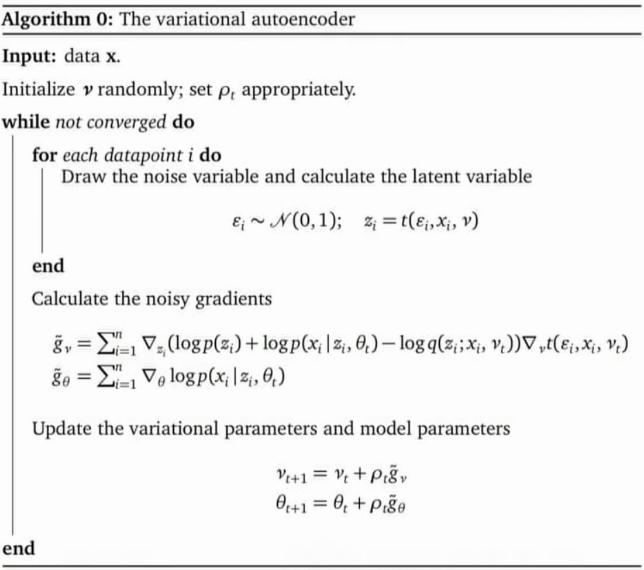

## 编码

编码是从高维信息降维得到低维信息的过程。

自编码器是输入 X 进行编码后得到 Y，再利用 Y 解码得到 X'.对比 X 与 X' 的误差，利用神经网络训练使得误差逐渐减小，达到非监督学习的目的。可以认为是非线性的 PCA。

## 解码

用深度生成式网络进行解码时，往往会假设
$$
\begin{array}{l}{p(\mathbf{z})=\operatorname{Normal}(0,1)} \\ {p(\mathbf{x} | \mathbf{z})=\operatorname{Normal}\left(\mu_{\beta}(\mathbf{z}), \sigma_{\beta}^{2}(\mathbf{z})\right)}\end{array}
$$
where $\mu$ and $\sigma^{2}$ are deep networks with parameters $\beta$

## Amortized Inference

变分分布依赖于第 i 个数据和共享的变分参数。于是原本的 ELBO 
$$
\mathscr{L}\left(\lambda, \phi_{1 \ldots n}\right)=\mathbb{E}_{q}[\log p(\beta, \mathbf{z}, \mathbf{x})]-\mathbb{E}_{q}\left[\log q(\beta ; \lambda)+\sum_{i=1}^{n} q\left(z_{i} ; \phi_{i}\right)\right]
$$
改写为
$$
\mathscr{L}(\lambda, \theta)=\mathbb{E}_{q}[\log p(\beta, \mathbf{z}, \mathbf{x})]-\mathbb{E}_{q}\left[\log q(\beta ; \lambda)+\sum_{i=1}^{n} q\left(z_{i} | x_{i} ; \phi_{i}=f_{\theta}\left(x_{i}\right)\right)\right]
$$

因此 ELBO 的目标式为

$$
\mathscr{L}(v)=\sum_{i=1}^{n} \mathbb{E}_{q\left(z_{i} ; x_{i}, v\right)}\left[\log p\left(z_{i}\right)+\log p\left(x_{i} | z_{i}, \theta\right)-\log q\left(z_{i} ; x_{i}, v\right)\right]
$$

## Reparameterization

$$
\begin{aligned} \varepsilon & \sim \mathcal{N}(0,1) \\ t\left(\varepsilon, x_{i}, v\right) &=\varepsilon+g\left(x_{i} ; v\right) \end{aligned}
$$

$$
\nabla_{v} \mathscr{L}=\sum_{i=1}^{n} \mathbb{E}_{s(\varepsilon)}\left[\nabla_{z_{i}}\left(\log p\left(z_{i}\right)+\log p\left(x_{i} | z_{i}, \theta\right)-\log q\left(z_{i} ; x_{i}, v\right)\right) \nabla_{v} t\left(\varepsilon, v, x_{i}\right)\right]
$$

## 步骤

符合 [BBVI 准则](https://baileyswu.github.io/2019/09/variational-inference/#Black-box-VI)。

- samples $\varepsilon_{i}$ for each datapoint and calculates $z_{i}$
- uses these samples to calculate noisy gradients with respect to $v$ and $\theta$
- follows those gradients in a stochastic optimization

