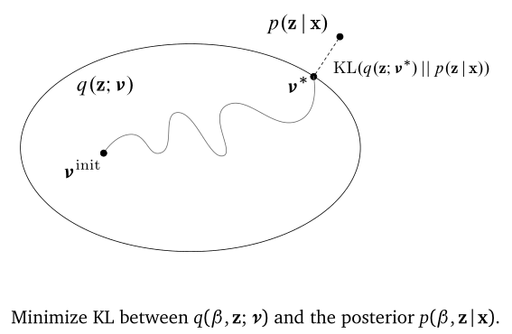
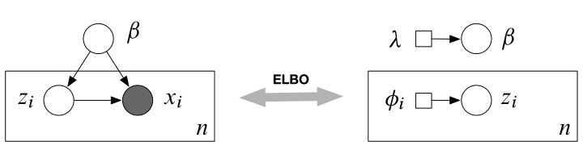

## Background
数据量大，如何挖掘其中的含义，找到其中的因果关系？

我们用机器学习和统计方法找到其中的联系。

流程一般是提出假设，挖掘出特征，得到预测，修改模型，提出假设……迭代进行。

**概率机器学习**的目标是学习出后验，即$p(z|x)={p(z,x) \over p(x)}$。其中联合概率可以用生成式得到，关于分母则需要边缘化隐变量，因此不易求得。

## Variational Inference

找到一个后验的近似分布 $q(z;v)$ 使得它们的 KL 散度尽量小。

先选择一个**分布族**，再在该分布族里优化参数 $v$，使得 KL 散度最小，此时是最优的后验分布 $q(z;v^*)$.

> 指数族分布  
$$
p(x)=h(x) \exp \left\{\eta^{\top} t(x)-a(\eta)\right\}
$$
- $\eta$ the natural parameter
- $t(x)$ the sufficient statistics
- $a(\eta)$ the log normalizer
- $h(x)$ the base density

### ELBO

KL 不易计算，因此 VI 优化 **证据下界（ELBO）** 来求解。

$$
\mathscr{L}(\nu)=\underbrace{\mathbb{E}_{q}[\log p(\beta, \mathbf{z}, \mathbf{x})]}_{\text {Expected complete log likelihood }}-\underbrace{\mathbb{E}_{q}[\log q(\beta, \mathbf{z} ; \boldsymbol{v})]}_{\text {Negative entropy }}
$$

第一项相当于联合似然，要尽可能大。第二项则相当于变分分布的熵取反，使 q 分布 diffuse.

还有一种分解 ELBO 的方式：
$$
\mathscr{L}(\nu)=\underbrace{\mathbb{E}_{q}[\log p(\mathbf{x} | \beta, \mathbf{z})]}_{\text {Expected log likelihood of data }}-\underbrace{\operatorname{KL}(q(\beta, \mathbf{z} ; \boldsymbol{v}) \| p(\beta, \mathbf{z}))}_{\text {KL between variational and prior }}
$$

第一项相当于似然，第二项是变分分布和真实分布的 KL 散度。

注意 ELBO 不一定是凸的。

### Mean-filed VI

平均场近似是指隐变量之间相互独立，则可以假设各自的分布。在优化其中一个变量时，固定住其他变量，进行优化。再迭代优化出所有变量。与 Gibbs Sampling 具有一些关联。

与 EM 类似，比较依赖于初始化设置，不同的初始化会得到截然不同的结果。由于非凸，只能取到局部最优值。

### Stochastic VI

传统的 VI 不能处理大量数据。因此需要随机 VI 来处理。

思想：大数据采出子集，进行局部结构的优化，再更新全局结构。再进行下一次迭代。

原始的 ELBO 的 natural gradient 是这样的  
$$
\nabla_{\lambda}^{\mathrm{nat}} \mathscr{L}(\lambda)=\left(\alpha+\sum_{i=1}^{n} \mathbb{E}_{\phi_{i}^{*}}\left[t\left(Z_{i}, x_{i}\right)\right]\right)-\lambda
$$  
经过随机优化，得到 noisy natural gradient 
$$
\begin{aligned} j & \sim \text { Uniform }(1, \ldots, n) \\ \hat{\nabla}_{\lambda}^{\text {nat }} \mathscr{L}(\lambda) &=\alpha+n \mathbb{E}_{\phi_{j}^{*}}\left[t\left(Z_{j}, x_{j}\right)\right]-\lambda \end{aligned}
$$

这样一个数据点就可以更新整个自然梯度。需要满足的前提是 noisy natural gradient 是无偏的，即$\mathbb{E}\left[\hat{\nabla}_{v} \mathscr{L}(v)\right]=\nabla_{v} \mathscr{L}(v)$。

### Recipe

一般的分布遵循以下步骤即可近似出后验分布：

1. Start with a model 
    $p(\mathbf{z}, \mathbf{x})$
2. 选择合适的变分分布
    $q(\mathbf{z} ; v)$
3. 根据两种拆分方式写出 ELBO，如
    $\mathscr{L}(v)=\mathbb{E}_{q(\mathbf{z} ; v)}[\log p(\mathbf{x}, \mathbf{z})-\log q(\mathbf{z} ; v)]$
4. 积分得到 ELBO
    Example: $\mathscr{L}(v)=x v^{2}+\log v$
5. 关于变分参数求梯度，优化 ELBO
    Example: $\nabla_{v} \mathscr{L}(v)=2 x v+\frac{1}{v}$
    $v_{t+1}=\nu_{t}+\rho_{t} \nabla_{\nu} \mathscr{L}$

## Black box VI

先积分 ELBO 再求梯度往往是比较困难的。是否可以先求梯度再积分，最后进行优化？

在推导模型时，求似然、后验、梯度等工作往往是费时费力的。能否将这些推理都放入黑盒中，我们最后只要输出后验？

Define
$$
g(\mathbf{z}, v)=\log p(\mathbf{x}, \mathbf{z})-\log q(\mathbf{z} ; v)
$$
可以推导出
$$
\nabla_{\nu} \mathscr{L}=\mathbb{E}_{q(\mathbf{z} ; \nu)}\left[\nabla_{\nu} \log q(\mathbf{z} ; \nu) g(\mathbf{z}, \nu)+\nabla_{\nu} g(z, \nu)\right]
$$

这样就把求梯度放在了积分里面。这样就可以从变分分布 q 中采样，用 Monte Carlo 估计出 q 的梯度，并进行随机优化，更新 q；迭代至收敛。

黑盒 VI 的主要目标是不论模型如何，我们只要做下面这三件事，其余的不用推理。最后黑盒可以输出近似的变分分布作为后验分布。

> Black Box Criteria  
-  sample from $ q(\beta, \mathbf{z}) $ 
-  evaluate $q(\beta, \mathbf{z})$ or function of $q$  
-  evaluate $\log p(\beta, \mathbf{z}, \mathbf{x})$  

有以下两种策略都符合 BBC：

- Score gradients
- Reparameterization gradients

### Score Function Gradients

See [score function](http://mathworld.wolfram.com/ScoreFunction.html), it is called *likelihood ratio* or *REINFORCE gradient*.

当$\mathbb{E}_{q}\left[\nabla_{v} g(\mathbf{z}, v)\right]=\mathbb{E}_{q}\left[\nabla_{v} \log q(\mathbf{z} ; v)\right]=0$，则 ELBO 的梯度可写为：  
$$
\nabla_{v} \mathscr{L}=\mathbb{E}_{q(\mathbf{z} ; v)}[\underbrace{\nabla_{v} \log q(\mathbf{z} ; v)}_{\text {score function }}(\underbrace{\log p(\mathbf{x}, \mathbf{z})-\log q(\mathbf{z} ; v))}_{\text {instantaneous ELBO }}]
$$

它的 noisy unbiased gradient 可以用 MC 得到：
$$
\begin{array}{r}{\hat{\nabla}_{\nu} \mathscr{L}=\frac{1}{S} \sum_{s=1}^{S} \nabla_{v} \log q\left(\mathbf{z}_{s} ; v\right)\left(\log p\left(\mathbf{x}, \mathbf{z}_{s}\right)-\log q\left(\mathbf{z}_{s} ; v\right)\right)} \\ {\text { where } \mathbf{z}_{s} \sim q(\mathbf{z} ; v)}\end{array}
$$

更新 $q$ 时，有
$$
\nu=\nu+\rho\hat{\nabla}_{\nu} \mathscr{L}
$$

因此实际上需要做的步骤：  
-  Sampling from $ q(\mathbf{z})$
-  Evaluating $ \nabla_{v} \log q(\mathbf{z} ; v) $
-  Evaluating $ \log p(\mathbf{x}, \mathbf{z})$ and $ \log q(\mathbf{z}) $

这个方法适用于离散或连续的模型，但是 noisy gradient 的方差可能会很大。

### Reparameterization gradients (Pathwise Gradients of the ELBO)

假设 $ \log p(\mathbf{x}, \mathbf{z})$ 和 $ \log q(\mathbf{z}) $ 关于 z 可微，可以将 z 分解成如下形式：

$$
\begin{aligned} \epsilon & \sim \operatorname{Normal}(0,1) \\ z &=\epsilon \sigma+\mu \\ & \rightarrow z \sim \operatorname{Normal}\left(\mu, \sigma^{2}\right) \end{aligned}
$$

这样不确定性就被转移到了 $\epsilon$.

$$
\nabla_{v} \mathscr{L}=\mathbb{E}_{s(\epsilon_)}[\underbrace{\nabla_{z}[\log p(\mathbf{x}, \mathbf{z})-\log q(\mathbf{z} ; v)]}_{\text {gradient of instanneous ELBO }} \underbrace{\nabla_{v} t(\epsilon, v)}_{\text {gradient of transformation }}]
$$

它的 noisy gradient 可以写成：
$$
\begin{array}\tilde{g}_{t}=\frac{1}{S} \sum_{s=1}^{S} \nabla_{z}\left[\log p\left(\mathbf{x}, t\left(\epsilon_{s}, v_{n}\right)\right)-\log q\left(t\left(\epsilon_{s}, v_{n}\right) ; v_{n}\right)\right] \nabla_{v} t\left(\epsilon_{s}, v_{n}\right) \\ {\text { where } \epsilon_{s} \sim s(\epsilon) \quad s=1 \ldots S}\end{array}
$$

这个方法要求模型必须可微。但是 noisy gradient 的方差是可控的。

## Reference
- [Variational Inference: Foundations and Modern Methods PDF](https://media.nips.cc/Conferences/2016/Slides/6199-Slides.pdf)
- [Variational Inference: Foundations and Modern Methods VIDEO](https://www.bilibili.com/video/av43405716/)