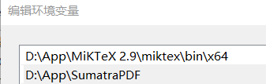
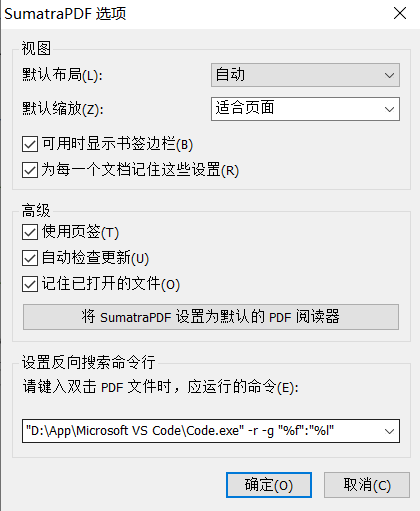
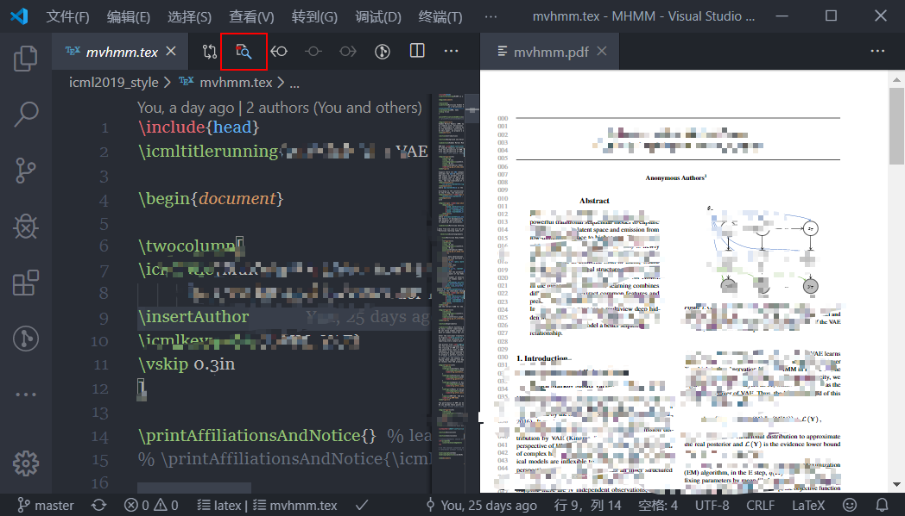

有没有一个软件，既可以拿来 debug python project, 又可以远程连接服务器修改上面的代码，还能用 LaTeX 写论文？答案是 Yes, VS Code! 而且它的功能还远不止于此，现在这篇博客也是用 VS Code 写的，因为它还可以预览 markdown.

[VS Code 下载](https://code.visualstudio.com/Download)

下面先介绍一种写论文常用的配置方案。

***

## 基础方

养成一个好习惯，每个 `Project` 都单独建立一个文件夹。在这个文件夹下用 `git` 维护历史记录。而我们经常要使用到的 VS Code 的一些配置，则放在 `.vscode/setting.json` 下，有助于切换电脑时也快速同步工作环境。

VS Code 可以非常方便地加扩展程序，推荐的基础款如下：
- Chinese (Simplified) Language Pack for Visual Studio Code / Microsoft
- GitLens — Git supercharged / Eric Amodio
- Sublime Text Keymap and Settings Importer / Microsoft
- Todo Tree / Gruntfuggly

***

## 配合 LaTeX 写论文

### 下载
- [MiKTeX](https://miktex.org/download) （LaTeX 的语法编译器）约200MB
- [Sumatra PDF](https://www.appinn.com/sumatra-pdf/) （轻量级的 PDF，可选）

### 增加扩展

- LaTeX Workshop / James Yu
- Dictionary Completion / Yu Zhang  
- Code Spell Checker / Street Side Software  

### 步骤

1. 安装 `MiKTeX` 后在环境变量中配置好路径。  
2. 若想使用 `Sumatra PDF` 可以一起配置。  

3. 在 `.vscode/setting.json` 中增加一些配置  
```json
{
  "editor.fontFamily": "'Sitka Text', Century, 'Bell MT', 'Times New Roman', cambria, Consolas, 'Courier New'",
  "editor.fontSize": 16,
  "dictCompletion.leastNumOfChars": 5,
  "terminal.integrated.fontFamily": "consolas",
  "latex-workshop.latex.recipes": [
    {
      "name": "PDFLaTeX",
      "tools": [
        "pdflatex"
      ]
    },
    {
      "name": "pdflatex -> bibtex -> pdflatex*2",
      "tools": [
        "pdflatex",
        "bibtex",
        "pdflatex",
        "pdflatex"
      ]
    },
  ],
  "latex-workshop.view.pdf.internal.synctex.keybinding": "double-click",
  "latex-workshop.intellisense.package.enabled": true,
  "latex-workshop.latex.clean.subfolder.enabled": true,
  "latex-workshop.view.pdf.zoom": "auto",
  "latex-workshop.latex.recipe.default": "lastUsed",
  "latex-workshop.view.pdf.viewer": "tab",

  // 如果需要使用 SumatraPDF 再增加以下配置
  "latex-workshop.view.pdf.external.viewer.command": "SumatraPDF.exe",
  "latex-workshop.view.pdf.external.viewer.args": [
    "%PDF%",
  ],
  "latex-workshop.view.pdf.external.synctex.command": "SumatraPDF.exe",
  "latex-workshop.view.pdf.external.synctex.args": [
    "-forward-search",
    "%LINE%",
    "%PDF%",
    "%TEX%"
  ],
}
```
4. 如果要使用 SumatraPDF 再在选项里增加配置用于之后的反向搜索  
`"D:\App\Microsoft VS Code\Code.exe" -r -g "%f":"%l"`  


### 愉快使用

- 自动编译
  
在本项目内 `ctrl+s` 保存 `.tex` 文件时，默认自动 `build` 成 `pdf`。在配置文件中修改了编译方式，默认使用 `PDFLaTeX` 编译。

- 改变编译选项
  
当需要增加引用时，即引用 `.bib` 文件时，可以使用 `pdflatex -> bibtex -> pdflatex*2` 选项编译。

设置了每次会自动使用上次编译的方式进行编译。更改编译方式则按键 `ctrl+shift+p`，选择 `LaTeX Workshop: Build with recipe` 后进行修改。

- 支持 PDF 反向搜索代码

点击右上角的按钮可以显示编译后的 `pdf`，并且双击 `pdf` 中的语句可以反向搜索 `.tex` 中对应的位置。使用 `Sumatra PDF` 同样可以双击反向搜索。


- 补全、预览等功能

除此之外还有各种隐藏功能呢！自动补全要引用的 `label` 都是小 case 了，你一打 `\fig` 再 `Tab`，就把插图的一大段代码都给你补全了。以及各种公式、图片预览功能，岂不美哉。

***

有不清楚的地方或者其他隐藏功能欢迎在下方留言~